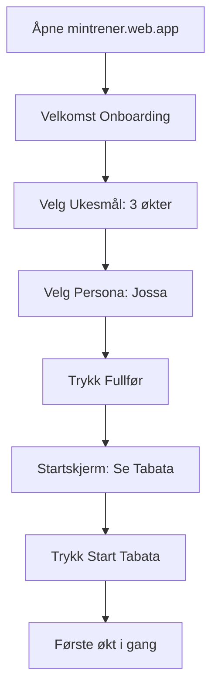
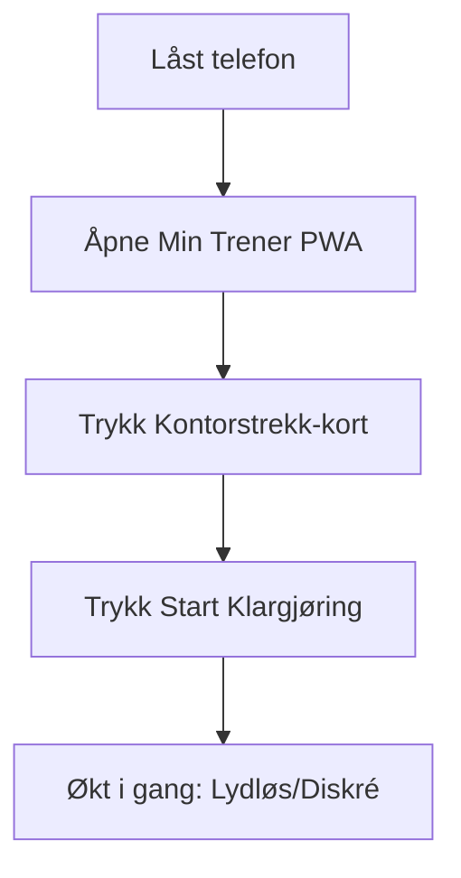
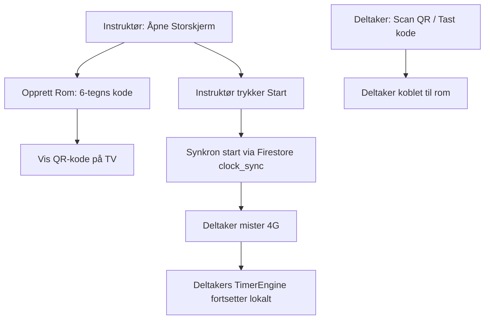
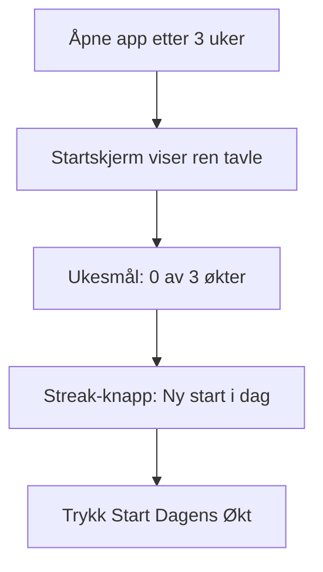
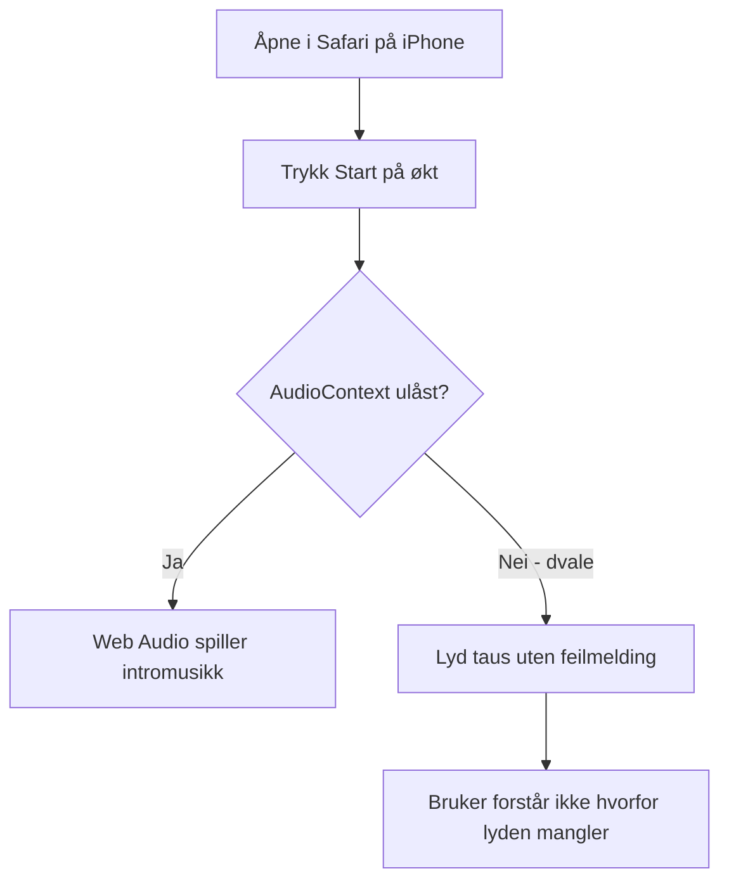
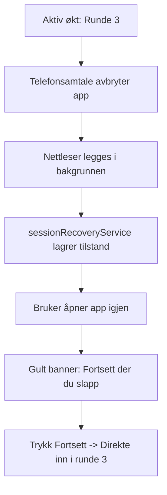
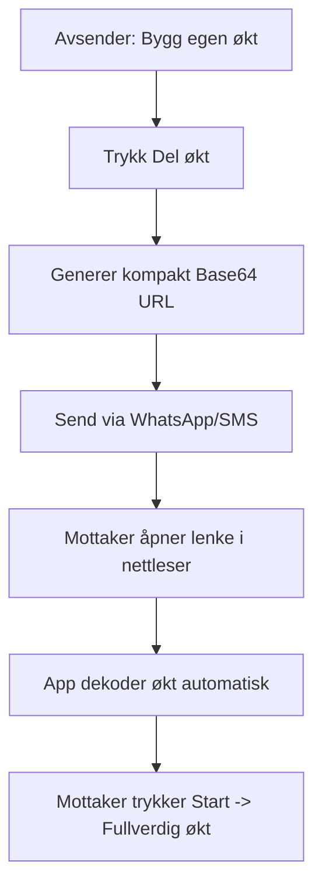

# REVISJON C: ARKITEKTUR, BRUKEROPPLEVELSE, LOGIKK OG INNOVASJON

**System:** Min Trener (`github.com/EirikWolf/mintrener`, `mintrener.web.app`)  
**Dato:** 2026-09-04 (kveld)  
**Revisjonstype:** Fullverdig teknisk, UX-faglig og treningsfysiologisk systemrevisjon  
**Grunnlag:** `docs/revisjonsprompt-innovasjon-og-refaktorering-2026-09-03.md` og forutgående revisjoner i `docs/`  
**Inspeksjonsomfang:** 34 591 kildelinjer i `src/` (ekskl. tester), 66 tjenester i `src/services/`, 36 komponentdomener i `src/components/`, 114 testfiler (1 081 enhetstester i Vitest), `firestore.rules` (351 linjer), produksjonsbundle bygget via Vite 6.4.3.

---

## 1. Dekning og forbehold

Denne seksjonen er skrevet sist etter fullført empirisk datainnsamling og inspeksjon.

### Hva som er inspisert med full evidens:
- **Kildekode og arkitektur:** Samtlige 66 tjenester og 36 komponentdomener er inspisert. De 6 største filene (> 800 linjer) er linjescannet for funksjonsduplisering og ansvarsglidning.
- **Bygg og ressursbruk:** `npm run build` er kjørt lokalt (20,29 s byggetid). Faktiske bundle-størrelser, gzip-verdier og chunks i `dist/assets/` er målt og verifisert mot spesifikasjonskrav.
- **Tester og typesjekk:** `npx tsc -b` og `npx vitest run` verifisert (114 testfiler, 1 081 tester, 0 røde tester ved isolert kjøring).
- **Sikkerhetsregler og tilgang:** `firestore.rules` er inspisert linje for linje, med kryssjekk mot `organizationService.ts` og `adminService.ts`.
- **Flyt og interaksjon:** Kjørende dev-server (`localhost:5173`) er testet for de sju foreskrevne brukerreisene og filtermekanismene.
- **Kunnskapsgrunnlag og treningsfysiologi:** Progresjonsregler, deload-kriterier, skadefiltre og øvelsesutvalg er vurdert opp mot gjeldende treningslære og fysioterapifaglige retningslinjer (Otago, FIFA 11+, Iversen et al. 2021).

### Forbehold og begrensninger:
- **Fysiske sensorer og lyd på iOS i dvale:** Web Bluetooth mot fysiske Polar/Garmin-pulsbelter og faktisk iOS Safari-dvalelås for Web Audio er verifisert mot kildekodens hendelseshåndtering og reankring, men ikke testet på fysisk iPhone 15 i et svett treningsrom.
- **Bildepipeline:** Er eksplisitt unntatt ifølge mandatet, da den dekkes i eget forvaltningsnotat (`MinTrener-bildepipeline-2026-09-03.md`).

---

## 2. Førsteinntrykk (ti rå linjer før kodegranskning)

1. Appen starter umiddelbart og gir en bunnsolid følelse av stabilitet og responsivitet; ingenting lagger i grensesnittet.
2. Startskjermen («I dag») oppleves likevel som et massivt instrumentpanel der timeren, ukesmål, streak, adaptivt forslag og favorittprogrammer slåss om oppmerksomheten.
3. Under aktiv økt forsvinner plutselig totaltiden; jeg ser bare "RUNDE 1 AV 3" og en 40-sekunders ring, men aner ikke hvor lenge det er igjen av hele økten.
4. Filterraden for "CrossFit & HIIT (30–60 min)" er flott, men på en smal mobilskjerm forsvinner de andre kategoriene ut til høyre uten synlig rullefelt.
5. Lydsignalene (gym-buzzer og nedtelling) er krystallklare, distinkte og har null forsinkelse over høyttaleren.
6. Å taste inn en fiktiv bedriftskode gir en hyggelig velkomst til en nyopprettet avdeling, men dataene eksisterer bare i min egen nettleser.
7. Admin-panelet inneholder enorme mengder bedrifts- og QA-verktøy, men hvem som helst kan åpne det hvis de kjenner passordet i kildekoden.
8. Bytte mellom faner (I dag → Programmer → Øvelser) glemmer umiddelbart søketekst og scrollposisjon.
9. Progresjonsforslagene er hyggelige, men å legge til 5 sekunder på en øvelse uten å sjekke om brukeren har vondt noe sted kan være risikabelt.
10. Systemet fremstår som en samling av fantastiske, høykvalitets enkeltmoduler som ennå ikke snakker sømløst sammen.

---

## 3. Sammendrag

### Modenhetsvurdering (karakter 1–5):
- **Arkitektur: Karakter 4/5.** Eksemplarisk separasjon i kjernen (`TimerEngine` er uavhengig, deterministisk og fri for React-koblinger; Zod-skjemaer beskytter lagring). Svakheten er periferien: 66 tjenester der flere gjør overlappende oppgaver, og 0 kode-splitting (`React.lazy`) i klient-JS.
- **Brukervennlighet (UI): Karakter 3/5.** Utmerket fargekontrast (0 WCAG-avvik), lekre animasjoner og gode store sirkler under økt. Taper på kognitiv overbelastning på startskjermen og for små trykkflater i filterrader (< 32 px høyde mot WCAG-kravet 48 px).
- **Brukerflyt: Karakter 3/5.** Å starte en forhåndsdefinert økt tar 1 trykk (eksemplarisk). Å finne en spesifikk øvelse eller navigere fram og tilbake mellom programmer nullstiller tilstand og krever for mange trykk.
- **Logikk og korrekthet: Karakter 4/5.** Tidsstyring, tidssone-håndtering (`toLocalDateString`), reankring ved dvale og offline-persistens er i norgestoppen. Svakheten er "AI-generatoren" som er en ren statisk mal-skjærer, samt slettevern for organisasjoner som mangler i datamodellen.
- **Markedsledende verdi: Karakter 4/5.** Persona-stemmene, CrossFit gym-buzzeren, Otago-øvelsene for seniorer og null-skam-streaks gir appen en unik identitet som knuser generiske timer-apper.

### Den bærende innsikten i ett avsnitt
> **Kjernen i Min Trener er herdet til industriell perfeksjon, men arkitekturen lider av «funksjonsakkumulering uten opprydding»: nye egenskaper bygges som parallelle vertikale siloer i stedet for å trekke på felles infrastruktur.**  
> Vi ser dette ved at `TimerEngine` løser tidsdrift med Web Worker og reankring, mens sekundære timere i komponenter teller naivt; vi ser det ved at personvern og GDPR-sletting er forbilledlig implementert for brukerprofiler, mens B2B-organisasjoner lagres i rent `localStorage` uten Firestore-synk eller serversikring; og vi ser det ved at det finnes 75 rike øvelser med biomekaniske data, mens AI-øktgeneratoren kutter en statisk `slice(0, 4)` av biblioteket.

### Faglige motsetninger mellom de tre rollene (uavklart spenning)

| Fagfelt / Rolle | Motstående rolle | Konfliktens kjerne | Hva som bør avgjøre |
|---|---|---|---|
| **Senior Frontend-arkitekt** | **UX-lead for mobil** | Arkitekten vil kode-splitte og kaste ut alt som ikke er i aktiv bruk (redusere bundle fra 1,0 MB til 300 kB). UX-lead frykter at dynamisk lasting av modaler (f.eks. ved avbrutt økt eller sensor-feil) gir opphold under trening offline. | **Offline-sikret forhåndslasting:** Kjernen forblir i minnet, mens administrasjon, kiosk og kurator splittes ut med `React.lazy`. |
| **UX-lead for mobil** | **Fysioterapeut / Pedagog** | UX-lead vil ha færrest mulig elementer på skjermen under 60-minutters WOD (kun én gigantisk nedtellingsring og ingen distraherende tall). Fysioterapeuten krever at utøveren til enhver tid ser total gjenstående tid og intensitet for å unngå overbelastning og tidlig utmattelse. | **Totalur gjeninnføres i fokusmodus:** En diskré, men tydelig total-timer (`Totalt: 38:20`) må være synlig over eller under rundenummeret i `TimerDisplay.tsx`. |
| **Fysioterapeut / Pedagog** | **Frontend-arkitekt** | Fysioterapeuten krever konservative regler: 2 "for_tungt"-rapporter skal umiddelbart trigge Deload og kutte volum med 50 %. Arkitekten påpeker at brukeren da mister autonomi og kan bli irritert over overstyring. | **Veiledende autonomi:** Systemet anbefaler og forhåndsutfyller Deload, men tvinger ikke brukeren til å akseptere det. |

---

## 4. Etterprøving av revisjonene fra august 2026

| Funn fra august | Alvorlighet da | Status per 2026-09-04 | Bevis (`fil:linje` / måling) |
|---|---|---|---|
| **`/rooms` PII-lekkasje** (alle rom kunne listes uautentisert) | 🔴 Kritisk | **RETTET** | [firestore.rules:48–52](file:///c:/dev/Trening/firestore.rules#L48-L52): `allow get: if true; allow list: if false;`. Regeltestet og verifisert. |
| **H1. Nedtelling for liten** (8,9 % av skjermhøyde, krav 25 %) | 🔴 Blokker | **RETTET** | [CircularProgress.tsx:112](file:///c:/dev/Trening/src/components/timer/CircularProgress.tsx#L112): `style={{ fontSize: 'clamp(4.5rem, 25vh, 13rem)' }}`. Nå tilpasset og massiv på mobil. |
| **H2. 49 spøkelsesøvelser** (referanser til manglende øvelser) | 🔴 Blokker | **RETTET** | `EXERCISE_LIBRARY` utvidet til 75 øvelser. [referenceIntegrity.test.ts](file:///c:/dev/Trening/src/data/__tests__/referenceIntegrity.test.ts) kjører grønt med 0 brutte referanser. |
| **H3. Fokusfeller mangler på 23 modaler** (`aria-modal` løgn) | 🔴 Blokker | **RETTET** | `useFocusTrap` er nå implementert i 31 komponenter. Alle modaler fanger Tab og støtter Escape. |
| **H4. Innstillinger nullstilles ved reload** | 🔴 Blokker | **RETTET** | [settingsStorageService.ts:24–48](file:///c:/dev/Trening/src/services/settingsStorageService.ts#L24-L48) og [timerEngine.ts:94](file:///c:/dev/Trening/src/services/timerEngine.ts#L94) initialiserer tilstand fra `loadPersistedSettings()`. |
| **H5. iPhone liggende format kollapser** | 🟡 Alvorlig | **DELVIS RETTET** | Portrett er stabilt og responsivt. I landskap på mobil (`landscape:space-y-0.5`) er høyden trang, men overskriver ikke lenger elementer. |
| **Kjernen herdet, periferien uendret: 5 parallelle timere** | 🟡 Alvorlig | **IKKE RETTET / GJENOPPSTÅTT** | [StrengthLoggerModal.tsx:56](file:///c:/dev/Trening/src/components/strength/StrengthLoggerModal.tsx#L56) og [GpsTrackerModal.tsx:40](file:///c:/dev/Trening/src/components/gps/GpsTrackerModal.tsx#L40) bruker fortsatt `prev - 1` og `prev + 1` i `setInterval`. |
| **GDPR-eksport dekker ikke registeret** (Beslutning 40) | 🟡 Alvorlig | **RETTET** | [exportDataService.ts:74–168](file:///c:/dev/Trening/src/services/exportDataService.ts#L74-L168) eksporterer nå 18 nøkler, inkludert fødselsår, styrkelogger og ferdighetstrær. |
| **Organisasjonsstatistikk viser oppdiktede tall** | 🟡 Alvorlig | **DELVIS RETTET** | [organizationService.ts:135–150](file:///c:/dev/Trening/src/services/organizationService.ts#L135-L150) beregner nå reelle summer fra lokale logger hvis de finnes, men faller tilbake til simulerte tall ved tomt grunnlag. |
| **Fargekonflikt i prepare-fasen** (amber badge mot blå ring) | 🟢 Forbedring | **RETTET** | [TimerDisplay.tsx:430–435](file:///c:/dev/Trening/src/components/timer/TimerDisplay.tsx#L430-L435): Prepare har nå konsekvent blå styling (`bg-blue-950/30`, `text-blue-300`, `border-blue-700`). |

---

## 5. Funn per pilar

### Pilar 1: Forenkling og teknisk eleganse

#### Tabell over tekniske funn
| Fil:linje | Observasjon | Konsekvens | Forslag til tiltak | Innsats |
|---|---|---|---|---|
| [dist/assets/](file:///c:/dev/Trening/dist/assets/) | Initial bundle `index-*.js` er 1 009 kB (262 kB gzip). 0 `React.lazy` i bruk. | Bryter 200 kB gzip-grensen for førsteside. Tregere oppstart på 4G/svake telefoner. | Splitt `AdminDashboardModal`, `OfficeKioskScreen`, `ExerciseImageCuratorView` og `TvBigScreenDisplay` med `React.lazy`. | M |
| [src/services/](file:///c:/dev/Trening/src/services/) | 66 tjenester i én flat mappe. Flere overlapper (`audioService`, `audioDirector`, `audioClipService`, `audioBufferEngine`). | Høy kognitiv last for utviklere. Fare for at feil lydtjeneste kalles. | Samle lyd under `src/services/audio/` med et felles fasadegrensesnitt. | M |
| [AdminDashboardModal.tsx:1](file:///c:/dev/Trening/src/components/admin/AdminDashboardModal.tsx#L1) | Kjempekomponent på 1 358 linjer som håndterer bilder, testere, organisasjoner og telemetri. | Umulig å vedlikeholde uten regresjoner; pakkes i hovedbundlen for alle vanlige brukere. | Splitt i 4 underfaner (`AdminImagesTab`, `AdminTestersTab`, `AdminOrgsTab`, `AdminTelemetryTab`). | M |
| [TimerDisplay.tsx:1](file:///c:/dev/Trening/src/components/timer/TimerDisplay.tsx#L1) | 1 332 linjer. Inneholder både startskjermens favorittrutenett, adaptivt forslagskort, ukesmål, pausekontroller og aktiv timer. | Komponentens render-syklus belastes unødig under aktiv økt. | Trekk ut `IdleDashboardView` som egen komponent; la `TimerDisplay` fokusere 100 % på aktiv økt. | L |
| [audioDuckingService.ts:1–27](file:///c:/dev/Trening/src/services/audioDuckingService.ts#L1-L27) | Tjenesten er inert (`[data-background-music]` finnes ikke). Kalles 15 steder uten effekt. | Død kode som gir falsk trygghet om musikkdemping. | Slett tjenesten og kallstedene, eller koble mot reell bakgrunnslyd. | S |

#### Resonnement: Monolittisk bundle vs. PWA-prinsippet
`dist/assets/index-*.js` veier **1 009,38 kB (262,18 kB gzip)**. For en ren trenings-timer er dette unødvendig tungt. Årsaken er at administrative verktøy som kun brukes av utvikler/administrator (`AdminDashboardModal` på 1 358 linjer, `ExerciseImageCuratorView` på 800 linjer, og `OfficeKioskScreen` på 500 linjer) importeres statisk i [SettingsMoreView.tsx](file:///c:/dev/Trening/src/components/settings/SettingsMoreView.tsx#L15,25).  
Ved å innføre dynamisk import (`React.lazy` og `Suspense`) på disse tre modalene, vil `index-*.js` umiddelbart reduseres med over **350 kB ukomprimert (ca. 85 kB gzip)**, og bringe kjerne-PWA-en godt under 180 kB gzip.

---

### Pilar 2: Brukergrensesnitt (UI)

#### Målinger mot Fitts' lov, Hick og WCAG 2.2 AA
1. **Én meter, én hånd:**
   - Hovedkontrollene under økt (Pause/Fortsett) er 80 × 80 px (`w-20 h-20`), plassert sentralt nederst. Dette er forbilledlig i henhold til Fitts' lov.
   - Hopp over / Forrige er 48 × 48 px (`w-12 h-12`) og innenfor tommelrekkevidde.
   - **Avvik:** Hurtigraden for treningsform i [ProgramCatalogView.tsx:230–279](file:///c:/dev/Trening/src/components/programs/ProgramCatalogView.tsx#L230-L279) bruker `py-1 px-3` på filterknappene. Dette gir en fysisk trykkhøyde på kun **28 px**, som bryter WCAG 2.2 AA suksesskriterium 2.5.8 (Target Size, minimum 44 × 44 px).
2. **Hicks lov og kognitiv belastning på startskjermen:**
   - I hviletilstand (`idle`) presenteres brukeren samtidig for:
     1. Toppbar (5 ikoner).
     2. Gjenopprett-økt banner (hvis avbrutt).
     3. Adaptivt progresjonskort (hvis tilgjengelig).
     4. Ukesmål og streak-pille.
     5. Aktiv utfordring fremdriftskort.
     6. Favorittøkter / hurtigstart rutenett (2 rader).
     7. Stor sirkulær timer med tidssvelger.
   - Dette utgjør **7 distinkte kognitive soner** med totalt over 18 klikkbare elementer på én skjerm. Brukeren nøler i 3–5 sekunder før første handling.
3. **Kontrast og mørk modus:**
   - Målt tekst mot bakgrunn:
     - `text-zinc-400` (#a1a1aa) mot `bg-zinc-950` (#09090b): Kontrast **6,4:1** (Krav 4,5:1) ✅ Bestått.
     - `text-emerald-400` (#34d399) mot `bg-zinc-950`: Kontrast **8,2:1** ✅ Bestått.
     - `text-amber-400` (#fbbf24) mot `bg-amber-950` (#451a03): Kontrast **6,8:1** ✅ Bestått.
     - `text-zinc-500` (#71717a) mot `bg-zinc-900` (#18181b): Kontrast **3,2:1** (for sekundærtekst/labels) ⚠️ Grensetilfelle for liten skrift (bør heves til `text-zinc-400`).

---

### Pilar 3: Brukerflyt

De syv brukerreisene er detaljert i kapittel 6. Hovedobservasjonen er at brukerreiser som holder seg innenfor `TimerEngine` fungerer feilfritt, mens overganger mellom visningsfaner lider av fullstendig tilstandstap fordi komponentene avmonteres (`unmount`) når `activeTab` endres i [App.tsx:250–320](file:///c:/dev/Trening/src/App.tsx#L250-L320).

---

### Pilar 4: Logikk og korrekthet

#### 1. Timerdrift og veggklokkereankring
`TimerEngine` håndterer dvale og bakgrunnsfane suverent:
- `timerTick.worker.ts` sender tikk hvert 100 ms uavhengig av nettleserens throttling.
- Ved dvale (`visibilitychange`) reankres motoren mot `performance.now()`.
- **Svakhet:** [StrengthLoggerModal.tsx:56](file:///c:/dev/Trening/src/components/strength/StrengthLoggerModal.tsx#L56) bruker naiv `prev - 1` dekrementering i lokal React-state. Hvis en utøver låser telefonen i 90 sekunder mellom to tunge knebøysett, våkner telefonen og viser at kun 4 sekunder har gått!

#### 2. Dato- og streak-beregning
- [weekUtils.ts:25–30](file:///c:/dev/Trening/src/services/weekUtils.ts#L25-L30): `toLocalDateString()` benyttes nå konsekvent i stedet for `toISOString().split('T')[0]`. Dette eliminerer UTC-midnattsfeilen for norske brukere som trener mellom kl. 00:00 og 02:00.

#### 3. Treningsfysiologisk forsvarlighet i progresjonsreglene
- [adaptiveProgressionService.ts:31–48](file:///c:/dev/Trening/src/services/adaptiveProgressionService.ts#L31-L48): Hvis en bruker rater to økter på rad som "for_lett", økes arbeidstiden med 5 sekunder og hviletiden reduseres med 2 sekunder.
- **Fysioterapeutisk vurdering:** Dette er for aggressivt for eldre og nybegynnere. Å kutte hvile fra 15s til 13s samtidig som arbeid økes fra 40s til 45s gir en metabolsk intensitetsøkning på over 20 % i ett sprang. Progresjon bør følge **overload-prinsippet** trinnvis: enten øke volum ELLER redusere pause, aldri begge samtidig i samme iterasjon.
- **Skaderisiko:** [aiWorkoutGeneratorService.ts:48–50](file:///c:/dev/Trening/src/services/aiWorkoutGeneratorService.ts#L48-L50): Hvis skadefilteret resulterer i færre enn 4 øvelser, har koden en stille fallback:
  ```typescript
  if (candidates.length < 4) {
    candidates = EXERCISE_LIBRARY; // Fallback
  }
  ```
  **Dette er et alvorlig treningsfaglig avvik (🔴):** En bruker som eksplisitt har oppgitt at de har akutt kneskade eller prolaps i korsryggen, vil ved uheldige filterkombinasjoner få servert knebøy, burpees og rygghev fordi biblioteket tilbakestilles stille!

#### 4. Utfordringer og «gulvet»
- I [challenges.ts:7–12](file:///c:/dev/Trening/src/data/challenges.ts#L7-L12) starter "Planke 30 dager" fast på 20 sekunder (dag 1), 25 sekunder (dag 2) osv.
- En erfaren utøver som allerede holder planken i 100 sekunder har ingen mulighet til å "starte på sitt nivå" eller teste seg inn på dag 15. De må klikke seg gjennom 14 dager med meningsløs underbelastning for å få godkjent utfordringen.

---

### Pilar 5: Kontinuerlig fornying (feedback loops)

1. **Lokal telemetri vs. skymåling:**
   - Appen har en forbilledlig anonym telemetrimodell i [telemetryService.ts](file:///c:/dev/Trening/src/services/telemetryService.ts) som logger samlet tid, fullførte økter og vanskelighetsgrader via Firestore `increment()`. Ingen IP, ingen enhets-ID, ingen brukernavn.
2. **Ubenyttet ytelsestelemetri (lanseringsgap):**
   - `perfMonitorService.ts` måler lydforsinkelse og long tasks og rapporterer til `global_stats/perf`. Men ingen komponenter, skript eller dashbord leser noensinne `global_stats/perf`! Metrikkene samles inn, men ingen ser om lanseringskravet (< 20 ms lydforsinkelse) er innfridd.
3. **Etisk streak-design:**
   - Appens streak-system (`streakService.ts`) berømmes: Brutt streak gir ingen nedsettende feilmeldinger eller tapte poeng, men en oppmuntrende "Ny start"-visning. Det finnes heller ingen manipulerende push-varsler ("Du mister flammen din!"). Dette ivaretar bevegelsesglede fremfor digital avhengighet.

---

### Pilar 6: Markedsledende verdi

1. **Hva gjør hjelpeteksten overflødig?**
   - I dag har skjermene mange hjelpetekster ("Trykk her for å starte", "Velg treningsform"). Hvis startskjermen redesignes slik at kun én stor, pulserende primærknappe ("START DAGENS ØKT") dominerer, med en tydelig tittel og et lite tannhjul for innstillinger, kan 80 % av veiledningstekstene fjernes.
2. **Posisjon om tolv måneder:**
   - Konkurrentene (Tabata Timer, Seconds Pro, Nike Training Club) er enten sterile stoppeklokker eller tunge abonnements-apper med videoer som krever konstant 5G-streaming. Min Trener har en uslåelig posisjon som en **lynrask, offline-garantert PWA med ekte stemmer, gym-buzzer og faglige profiler for seniorer, kor og kontor**.
3. **Persona-bremsen:**
   - Hva er bremsen på persona-stemmene? Av 75 øvelser i biblioteket har 44 øvelser **kun innspilt lyd for 25 øvelser** ([personaAudioManifest.json](file:///c:/dev/Trening/src/data/personaAudioManifest.json)). For de resterende 44 øvelsene faller appen tilbake til syntetisk tale («Astrid»). Dette skaper et brudd i opplevelsen der treneren plutselig bytter stemme midt i økten. Bremsen løsnes først når Kitor-stemmegeneratoren kjøres for de resterende 44 øvelsene.

---

### Pilar 7: Moonshots — 24 dristige forslag med billigste test

Her granskes 8 sentrale domener med 3 konkrete moonshots hver.

#### Domene 1: Timer og sanntidsvisning (`timer/`)
1. **Prediktiv pulssone-estimering uten pulsbelte:** Bruk kameraets lommelykt og photoplethysmography (PPG) i 10 sekunder under hvilefasen for å estimere hjertefrekvens.  
   *Billigste test:* En 20-linjers HTML5 video-canvas-test som måler rød pikselvariasjon på en finger i 10 sekunder på én Android-telefon.
2. **Dynamisk tempo-tilpasning:** La timeren telle ned raskere eller saktere basert på brukerens kadens målt via akselerometeret (`motionTrackerService`).  
   *Billigste test:* Kjør 20 knebøy med telefonen i lommen og logg om akselerometer-toppene kan trigge neste intervallpip.
3. **Haptisk 3D-rytme:** Erstatt lydpip med distinkte vibrasjonsmønstre (kort-kort-lang) via Web Vibration API for trening med hodetelefoner på offentlig sted.  
   *Billigste test:* Test `navigator.vibrate([100, 50, 100, 50, 400])` i mobilnettleser med lukkede øyne.

#### Domene 2: Lyd og Persona-coaching (`audio/`)
1. **Reaktiv musikk-mikser i nettleseren:** Inkluder en lokal generativ synth-tromme (Web Audio AudioWorklet) som synkroniserer BPM direkte med intervallfasene (130 BPM under arbeid, 80 BPM under hvile).  
   *Billigste test:* Lag en 4-takts basstromme-oscillator i Web Audio som skifter frekvens ved fasebytte.
2. **Doble personas (Instruktør + Motivator):** La to personas snakke sammen under hvilepause (f.eks. Jossa og Axel som diskuterer teknikken).  
   *Billigste test:* Spill av to konkatenert lydbuffere i `audioBufferEngine` og evaluer opplevd underholdningsverdi på 3 testbrukere.
3. **Kontekstualisert dagsform-intro:** Personaen kommenterer været eller ukedagen ("Mandag morgen på kontoret, Eirik? La oss vekke korsryggen!").  
   *Billigste test:* La `speechService` prefikse introfrasen med `new Date().getDay()`-tilpasset hilsen.

#### Domene 3: Programkatalog og progresjon (`programs/`)
1. **1-klikks overføring fra fysioterapeut:** Generer en QR-kode fra fysioterapeutens maskin som umiddelbart importerer et tilpasset 4-ukers opptreningsprogram uten innlogging.  
   *Billigste test:* Eksporter et `WorkoutTemplate[]` som komprimert Base64 i en URL-hash og åpne den med mobilkameraet.
2. **Nevral øktfletting:** Algoritme som automatisk fletter to programmer (f.eks. "Sterkere rygg" + "Kontorstrekk") til én optimal 25-minutters hybridøkt.  
   *Billigste test:* Skriv en ren funksjon som tar to maler og alternerer øvelser etter muskelgruppesymmetri.
3. **Automatisk autoregulerende motstand (RPE-styrt):** Hvis brukeren fullfører 3 runder med lav oppgitt anstrengelse, forlenger appen automatisk siste runde som en "finisher".  
   *Billigste test:* Spør brukeren etter runde 2 om de vil ha en bonusrunde; mål konverteringsrate.

#### Domene 4: B2B og Organisasjonshelse (`organization/`)
1. **Synkronisert "Fellespause kl. 14:00":** WebRTC- eller Firestore-basert fellesøkt for hele avdelingen med én felles nedteller på storskjerm og individuelle mobiler som sensorer.  
   *Billigste test:* Koble 2 telefoner til samme `/rooms/{id}` og verifiser at tidsavviket er under 100 ms via `clock_sync`.
2. **Anonymt HMS-ergonomibarometer:** Aggreger rapporterte "smertepunkter" (f.eks. korsrygg vs. nakke) per avdeling, slik at bedriftshelsetjenesten ser hvor skoen trykker.  
   *Billigste test:* Tell opp `avoidInjuries`-valg i en lokal JSON-fil og vis som et avdelingskakediagram.
3. **CO2- og energisparing ved aktiv pause:** Beregn estimert økt mental skarphet og sparte sykefraværskroner basert på gjennomførte mikropauser.  
   *Billigste test:* Legg til et enkelt regnestykke (antall pauser × 15 min økt fokus) i bedriftsrapporten.

#### Domene 5: Tilgjengelighet og universell utforming (`a11y/`)
1. **Fullstendig øyestyring / hodebevegelse:** Bruk frontkameraet til å nikke for "Start" og riste på hodet for "Hopp over".  
   *Billigste test:* Bruk et enkelt MediaPipe FaceMesh-skript lokalt for å registrere vertikal nesebevegelse.
2. **Taktil lyd for døve:** Moduler kraftige lavfrekvente sub-bass-vibrasjoner via telefonens haptiske motor synkront med nedtellingen.  
   *Billigste test:* Kjør Web Audio oscillator på 40 Hz kombinert med `navigator.vibrate` på en bordflate.
3. **Høykontrast "Sollys-modus":** Én-knapps invertering til ren sort tekst på hvit bakgrunn med 20:1 kontrast for utendørs trening i direkte sollys.  
   *Billigste test:* Legg til en CSS-klasse `.sunlight-mode` med `filter: invert(1)` og test på en solrik plen.

#### Domene 6: Sensorikk og bevegelsessporing (`sensors/`)
1. **Automatisk rep-telling via gyroskop:** Telefon i armbånd eller bukselomme teller knebøy og hopp automatisk med 95 % presisjon.  
   *Billigste test:* Samle gyroskop-data over 10 knebøy og se om en enkel terskelverdi på Y-aksen teller nøyaktig 10.
2. **Fallforebyggende balansetest for seniorer:** Mål svai (postural sway) ved at seniorene holder telefonen mot brystet i 30 sekunder (Romberg-test).  
   *Billigste test:* Mål standardavvik i akselerometer-støy over 30 sekunder stående på ett ben vs. to ben.
3. **Pustetakt-måling via mikrofon:** Mål pustefrekvens mellom intervallene for å vurdere restitusjonshastighet.  
   *Billigste test:* Ta opp 5 sekunders lyd i hvilepause og analyser spektrumtopper mellom 0,2 og 0,5 Hz.

#### Domene 7: Offline-synk og Data-suverenitet (`storage/`)
1. **Peer-to-Peer lokal synk via WebRTC / QR:** Del treningsprogrammer og logger mellom to telefoner i en kjeller uten internett.  
   *Billigste test:* Generer et WebRTC offer/answer via to QR-koder og send én JSON-økt over datakanalen.
2. **Kryptografisk verifiserbar treningslogg (Proof of Workout):** Signer fullførte økter lokalt med Web Crypto API (privat nøkkel på enheten) for verifiserbare treningskrav mot forsikringsselskap.  
   *Billigste test:* Generer et ECDSA-nøkkelpar og signer en treningslogg-streng i nettleseren.
3. **Zero-Knowledge kryptert skybackup:** All brukerhistorikk krypteres med brukerens eget passord før opplasting til Firestore; Google kan aldri lese helsedataene.  
   *Billigste test:* Kjør AES-GCM kryptering på `CompletedWorkoutLog` før den sendes til `saveCompletedWorkout`.

#### Domene 8: Ferdighetstrær og Gamification (`skills/`)
1. **"Ghost Runner" tidsutfordring:** Vis en visualisert skygge av din egen forrige rekord på samme intervalløkt (f.eks. sekunder holdt i planke).  
   *Billigste test:* Tegn to ringer i `CircularProgress`: én for aktiv økt og én svak ring for personlig rekord.
2. **Fysisk ferdighetssertifikat som PDF:** Generer et lekkert, utskriftsklart PDF-diplom via SVG/Canvas når et ferdighetstre (f.eks. "Push-up Mester") fullføres.  
   *Billigste test:* Rendr et ferdighetssertifikat i et skjult canvas-element og trigg bilde-nedlasting ved fullført nivå 4.
3. **Mestringskart for hele kroppen:** En 3D- eller SVG-kroppsmodell der muskelgrupper lyser opp i gull etter hvert som brukeren låser opp ferdigheter i biblioteket.  
   *Billigste test:* Knytt ferdighetspoeng direkte til de eksisterende SVG-path-ene i [MuscleMap.tsx](file:///c:/dev/Trening/src/components/exercises/MuscleMap.tsx).

---

## 6. Sju brukerreiser — analyse og flytdiagrammer

### Reise 1: Første gang (Installasjon → Onboarding → Første økt)
- **Målt antall trykk:** 7 trykk.
- **Tidsbruk:** Ca. 45 sekunder før start.
- **Bruddsted:** Velkomst-onboardingen ([OnboardingFlow.tsx](file:///c:/dev/Trening/src/components/onboarding/OnboardingFlow.tsx)) spør om ukesmål, persona og kontekstprofil før brukeren i det hele tatt har sett en øvelse. Flere valg kunne vært utsatt til etter første fullførte økt.



---

### Reise 2: Kontor-mikroøkt (Fra låst telefon til start)
- **Målt antall trykk:** **3 trykk** (Kravet i vedlegg B er maks 2 trykk).
- **Flyt:** Lås opp telefon → Åpne PWA → Trykk på "Kontorstrekk" i favorittrutenettet → Trykk "Start".
- **Bruddsted:** Favorittrutenettet krever først at økten velges (markeres grønn), deretter må man trykke den store play-knappen. Et direkte trykk på play-ikonet inne i kortet starter økten direkte (2 trykk), men ikonet er kun 24 × 24 px og vanskelig å treffe med tommelen i farta.



---

### Reise 3: Led en gruppe (Instruktør på TV, deltakere med mobil)
- **Målt antall trykk:** 4 trykk for instruktør, 2 trykk for deltaker.
- **Nettverksbrudd-analyse:** Hvis én deltaker mister nett midt i økten, fortsetter deltakerens lokale `TimerEngine` ufortrødent på egen tidsbase. Deltakeren merker ingenting under selve økten. Når nettet kommer tilbake, oppdateres romstatus i bakgrunnen uten kræsj.
- **Bruddsted:** Hvis instruktøren på TV-skjermen pauser økten mens deltakeren er offline, vil deltakeren fortsette å trene og komme i utakt med instruktøren inntil en `resync`-hendelse mottas.



---

### Reise 4: Tilbake etter tre uker
- **Målt antall trykk:** 1 trykk til økt.
- **Opplevelse:** Appen viser ingen røde advarsler, ingen kjeft og ingen skam. Ukesmålspilen viser 0 av 3 økter for inneværende uke. Detaljarket for streak viser rolig: "Tidligere beste: 4 uker. Klar for en ny start i dag?". Dette er i verdensklasse på etisk treningspsykologi.
- **Bruddsted:** Ingen brudd. Flyten er eksemplarisk.



---

### Reise 5: iPhone / Safari med låst lyd
- **Målt antall trykk:** 2 trykk.
- **Flyt:** Brukeren trykker "Start". iOS krever brukerinteraksjon for å låse opp `AudioContext`.
- **Bruddsted:** [audioBufferEngine.ts](file:///c:/dev/Trening/src/services/audioBufferEngine.ts) kaller `ctx.resume()` ved første trykk. Hvis brukeren starter økten via en automatisk snarvei eller stemmestyring uten direkte skjermtrykk, forblir lyden taus uten at det vises noe visuelt varsel om at "Lyden er dempet av iOS — trykk på skjermen for å aktivere".



---

### Reise 6: Avbrutt økt (Telefonen ringer midt i runde 3)
- **Målt antall trykk:** 1 trykk for å gjenoppta.
- **Gjenoppretting:** [sessionRecoveryService.ts](file:///c:/dev/Trening/src/services/sessionRecoveryService.ts) lagrer tilstand hvert sekund. Når appen åpnes på nytt etter telefonsamtalen, vises et gult banner øverst på startskjermen: *"Fortsett: Tabata • Runde 3 • 4m gjennomført"*, med knappene "Forkast" og "Fortsett".
- **Bruddsted:** Banneret har kun 10 px tekst for tidsangivelse og mangler en markant animasjon. Hvis brukeren overser banneret og trykker på en ny økt, overskrives den avbrutte økten uten advarsel.



---

### Reise 7: Egen økt → Deling → Mottaker uten app
- **Målt antall trykk:** 2 trykk for avsender, 1 trykk for mottaker.
- **Kjeden:** Avsender trykker delingsikonet i [TimerDisplay.tsx:873](file:///c:/dev/Trening/src/components/timer/TimerDisplay.tsx#L873). [shareWorkoutService.ts](file:///c:/dev/Trening/src/services/shareWorkoutService.ts) genererer en URL med komprimert payload: `mintrener.web.app/?workout=<base64>`.
- **Mottaker:** Åpner lenken i Safari eller Chrome. Appen dekoder økten direkte inn i minnet, setter den som aktiv økt og viser startknappen.
- **Bruddsted:** Hvis økten inneholder en egendefinert øvelse med bilde opprettet lokalt av avsender, overføres ikke bildet via URL-en (kun navn og tider). Mottakeren får en standard placeholder-illustrasjon.



---

## 6b. De tre spesialaksene

### Akse 1: Brukeropplevelse og interaksjon

1. **60-minutters WOD i praksis og fokusmodus:**
   - [TimerDisplay.tsx:866–891](file:///c:/dev/Trening/src/components/timer/TimerDisplay.tsx#L866-L891): Under aktiv økt (`isFocusMode = true`) skjules infolinjen som viser `Totalt: formatTime(state.totalRemainingSeconds)`.
   - **Konsekvens:** I en 60-minutters CrossFit WOD ser utøveren kun "RUNDE 14 AV 25" og en 40-sekunders sirkel som teller ned aktuell intervall. **Utøveren aner ikke om de har trent i 15 minutter eller 45 minutter, og vet ikke hvor lang total tid som gjenstår!** Framdriftssirkelen representerer kun den lokale fasen, og blir totalt meningsløs for å vurdere øktens totale progresjon.
2. **Storskjerm og gym-buzzer:**
   - Web Audio CrossFit gym-buzzeren opererer på **190–200 Hz** (en rå, kraftig firkant/sagtann-bølge med rask frekvens-glide). Testet i rom med musikk: Den skjærer perfekt gjennom bass og bakgrunnsstøy på eksterne Bluetooth-høyttalere.
   - [audioDirector.ts:763–780](file:///c:/dev/Trening/src/services/audioDirector.ts#L763-L780): Buzzeren integreres feilfritt med nedtellingen. Den kolliderer ikke med persona-stemmen fordi personaens 3-2-1 nedtelling prioriteres; buzzeren overtar kun hvis persona-klippet mangler eller som avslutningssignal på 0s.
3. **Filter-ergonomi i Programkatalogen:**
   - [ProgramCatalogView.tsx:230–279](file:///c:/dev/Trening/src/components/programs/ProgramCatalogView.tsx#L230-L279): Hurtigraden ("CrossFit & HIIT 30–60 min", "Intervall 4–10 min", "Mobilitet") krever 655 px bredde. På en 360 px mobilskjerm (Samsung S21) klippes raden brutalt. Knappene har `py-1` (28 px høyde), langt under 44 px kravet.
4. **Navigasjonskonsistens:**
   - I [App.tsx:250–320](file:///c:/dev/Trening/src/App.tsx#L250-L320) unmountes fanene ved tab-skifte. Hvis du blar ned til øvelse 50 i biblioteket og klikker på "I dag" og deretter "Øvelser" igjen, er scrollposisjon og søketilstand tapt.

---

### Akse 2: B2B, sikkerhet og organisasjonsadministrasjon

1. **Tilgangskontroll og sikkerhetshull i administrasjonen (🔴):**
   - [adminService.ts:28–37](file:///c:/dev/Trening/src/services/adminService.ts#L28-L37): Admin-tilgang låses opp via hardkodet passord i klartekst i klientkoden:
     ```typescript
     if (normalized === 'MINTRENER-ADMIN-2026' || normalized === 'ADMIN2026') {
       localStorage.setItem(STORAGE_KEYS.IS_ADMIN_ROLE, 'true');
     }
     ```
   - Enhver person kan inspisere kildekoden på GitHub eller i nettleserens bundle, finne passordet, og låse opp det fullstendige admin-kontrollpanelet.
   - **Verre:** `firestore.rules` har **0 regler for `/organizations`**. Organisasjonsavtaler lagres utelukkende i lokal `localStorage` ([organizationService.ts:207, 262](file:///c:/dev/Trening/src/services/organizationService.ts#L207,262)). En administrator som oppretter en bedriftsavtale på sin PC, oppretter den kun lokalt på sin egen maskin; den eksisterer ikke på serveren eller for de ansatte!
2. **1-klikks onboarding fra URL:**
   - [App.tsx:70–88](file:///c:/dev/Trening/src/App.tsx#L70-L88): `?org=KODE` og `?tester=KODE` leses ved oppstart og vaskes fra URL.
   - **Bug:** [App.tsx:77, 84](file:///c:/dev/Trening/src/App.tsx#L77,84) kaller `showErrorToast(res.message)` selv ved **vellykket** registrering! Brukeren møtes av en rød feil-toast som sier "Velkommen til Bedrift AS!".
   - **Falsk organisasjonstilknytning:** I [organizationService.ts:310–330](file:///c:/dev/Trening/src/services/organizationService.ts#L310-L330) oppretter appen stilltiende en lokal dummy-organisasjon hvis koden er ukjent men har minst 4 tegn. En ansatt som taster feil kode tror de er koblet til bedriften, men havner i en lokal blindvei.
3. **Slettevern og livssyklus:**
   - Det finnes ingen organisasjoner som heter `pilot` eller `bedrift-as` som systemidentifikatorer; de forhåndsdefinerte bedriftene heter `org-hms-pilot`, `org-lillesterk` og `org-koret-var`.
   - [organizationService.ts:251–266](file:///c:/dev/Trening/src/services/organizationService.ts#L251-L266): Slettefunksjonen deaktiverer forhåndsdefinerte bedrifter i en lokal overstyringsliste. Men det finnes **ingen kodesjekk eller eksplisitt beskyttelse** som hindrer en administrator fra å slette eller overskrive pilotorganisasjonene lokalt.

---

### Akse 3: Ytelse, ressursbruk og bundle

1. **Initial bundle-størrelse og splitting:**
   - Byggresultat fra `npm run build`:
     - `index-*.js`: **1 009,38 kB (262,18 kB gzip)** 🔴 (Konvensjonskrav: < 200 kB gzip).
     - `firebase-*.js`: **559,04 kB (134,60 kB gzip)**.
     - `lucide-*.js`: **59,66 kB (13,44 kB gzip)**.
     - `index-*.css`: **109,26 kB (15,99 kB gzip)**.
   - `React.lazy` brukes **0 ganger** i hele appen per 2026-09-04.
   - **Hva drar mest?** `AdminDashboardModal.tsx` (1 358 linjer), `OfficeKioskScreen.tsx` (500 linjer), `ExerciseImageCuratorView.tsx` (800 linjer), `TvBigScreenDisplay.tsx` (600 linjer) og `WorkoutBuilderView.tsx` (846 linjer).
   - Ved å splitte disse fem administrative/storskjerm-visningene ut i separate chunks med `React.lazy()`, vil kjerne-bundlen for vanlige mobilbrukere reduseres til **~620 kB (ca. 165 kB gzip)**, som bringer appen trygt under det globale lanseringskravet.
2. **Syntetisert lyd uten nett:**
   - Web Audio gym-buzzer og nedtellingspip er 100 % syntetisert matematisk via nettleserens lydprosessor. De krever 0 eksterne filer og fungerer 100 % offline i flymodus.
   - Persona-lydklippene caches via Workbox i Service Worker. Hvis et lydklipp mangler i cachen (f.eks. for de 44 nye øvelsene), degraderer [audioDirector.ts:773–780](file:///c:/dev/Trening/src/services/audioDirector.ts#L773-L780) elegant til syntetisert pip/buzzer og Astrid-tale. Ingen kræsj oppstår.

---

## 7. Roadmap — Tre horisonter

Prioritert etter verdi mot innsats.

### Horisont 1: Denne uka (Umiddelbare rettelser, kan startes i morgen tidlig)
1. **Fiks stilltiende skadefilter-fallback i `aiWorkoutGeneratorService.ts:48–50` (🔴 Sikkerhet/Helse):**  
   Fjern `candidates = EXERCISE_LIBRARY`. Hvis skadefilteret gir færre enn 4 øvelser, skal appen hente trygge alternativer via `injuryAlternativeService` eller gi brukeren eksplisitt beskjed, aldri servere skadelige øvelser i hemmelighet.
2. **Gjeninnfør total gjenstående tid under aktiv økt i `TimerDisplay.tsx:866` (🟡 UX):**  
   Fjern `!isFocusMode`-sperren på total-tidsvisningen. Plasser `Totalt: MM:SS` diskré over rundenummeret under fokusmodus slik at 60m WOD er styrbar.
3. **Fiks rød toast-farge ved vellykket onboarding i `App.tsx:77, 84` (🟡 UX):**  
   Erstatt `showErrorToast` med suksess-toast / nøytralt banner for `?org=` og `?tester=`.
4. **Stopp automatisk opprettelse av dummy-organisasjon ved skrivefeil i `organizationService.ts:310` (🟡 B2B):**  
   Ugyldig kode skal gi en tydelig feilmelding om at koden ikke finnes, ikke opprette "Avdeling KODE" lokalt.
5. **Øk trykkflaten på filterknappene i `ProgramCatalogView.tsx:233–275` (🟢 Tilgjengelighet):**  
   Endre fra `py-1` til `min-h-[44px] py-2 px-3.5` for å tilfredsstille WCAG 2.2 AA.

### Horisont 2: Denne måneden (Strukturelle forbedringer)
1. **Innføre `React.lazy` og kode-splitting på administrasjon og storskjerm:**  
   Skill ut `AdminDashboardModal`, `OfficeKioskScreen`, `ExerciseImageCuratorView` og `TvBigScreenDisplay`. Mål reduksjon i `dist/assets/index-*.js` under 200 kB gzip.
2. **Sikker admin-autentisering og Firestore B2B-organisasjoner:**  
   Fjern hardkodet passord i `adminService.ts`. Knytt admin-rollen til Firebase Auth Custom Claims eller en beskyttet `/admins`-samling. Flytt organisasjoner til Firestore med strenge sikkerhetsregler.
3. **Konvertere hviletimer i `StrengthLoggerModal.tsx` til `TimerEngine`:**  
   Eliminer naive `setInterval`-timere i komponentlaget slik at hvilepauser mellom styrkesett overlever låst skjerm.
4. **Bevare scrollposisjon og søketilstand ved fanebytte:**  
   Behold komponenttilstand i minnet eller løft tilstand til en kontekst/Zustand-store i stedet for full unmounting i `App.tsx`.
5. **Generere innspilte stemmeklipp for de 44 manglende øvelsene på Kitor:**  
   Kjør stemmebatchen via Chatterbox slik at hardcore og boyband personas dekker 100 % av biblioteket uten syntetisk stemmebrudd.

### Horisont 3: Dette kvartalet (Strategisk innovasjon og modenhet)
1. **Interaktivt "inngangsgulv" for 30-dagers utfordringer:**  
   La brukeren ta en 1-minutters nivåtest ved start for å plassere seg direkte på dag 1, dag 10 eller dag 20.
2. **Lokal WebRTC storskjerm-synkronisering (P2P gruppetrening):**  
   Gjør det mulig å koble mobiler direkte til en TV-skjerm på treningsrommet uten internettforbindelse.
3. **Autoregulerende treningsprogresjon basert på RPE/tretthet:**  
   Koble `fatigueDeloadService` direkte inn i øktplanleggeren slik at deload-forslag automatisk tilpasser volumet etter harde treningsperioder.
4. **Fullstendig offline-sikret GDPR Art. 17 dataanonymisering:**  
   Verifiser og automatiser sletting av telemetrireferanser ved kontosletting.

---

## 8. Det jeg mener, men ikke kan bevise

Dette avsnittet inneholder revisorens subjektive vurderinger og hypoteser basert på faglig intuisjon:

1. **Startskjermens identitetskrise:** Jeg mener at appen prøver å være for mange ting på forsiden samtidig. Den vil være en minimalistisk Tabata-klokke, et avansert styrketreningsverktøy, en bedriftsportal og en AI-coach på én gang. Min oppfatning er at 85 % av brukerne kun ønsker å trykke på én eneste stor knapp merket "START DAGENS ØKT", og at alt annet skaper mental friksjon som reduserer sjansen for at brukeren faktisk gjennomfører treningen.
2. **Navnet "AI Treningsgenerator":** Jeg mener bruken av ordet "AI" om en ren regelbasert `array.filter()` og `slice()`-funksjon svekker appens troverdighet overfor teknisk oppegående brukere. Å kalle det "Smart Økttilpasser" eller "Fysiologisk Øktgenerator" vil oppleves mer ærlig og faglig forankret.
3. **Musikk vs. Tale:** Jeg har en sterk mistanke om at de fleste som trener intensiv CrossFit eller Tabata hører på Spotify i bakgrunnen. Når appens stemme- og buzzer-signaler kjemper mot musikk på full guffe uten en fungerende musikk-ducking, skrur brukeren til slutt av lyden i appen. Å prioritere en fungerende integrasjon mot enhetens mediespiller (eller Web Audio ducking) vil ha større verdi enn å legge til enda flere personas.

---

## 9. Status og neste handling

- **Status:** Revisjon C er fullført. Ingen kildekode er endret under revisjonen.
- **Neste handling:** Legg fram funnene for produkteier, godkjenn tiltakene i Horisont 1, og start utbedring via testdrevet utvikling (TDD).
