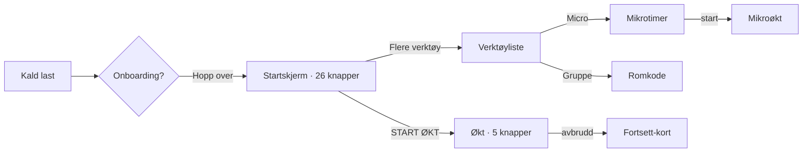

# REVISJON D: ARKITEKTUR, UI, FLYT, LOGIKK OG INNOVASJON — 2026-09-05

**Grunnlag:** `docs/revisjonsprompt-innovasjon-og-refaktorering-2026-09-05-v2.md`
**Revidert tilstand:** arbeidstreet i `C:\dev\Trening` natt til 5. september, HEAD `cd98e5f` + 33 ucommitede sporede filer (28 bilder, `firestore.rules`, fire skript). Der HEAD og arbeidstre er ulike, står det.
**Ingen endringer er gjort i løsningen.** Bygg og testkjøring gikk til en midlertidig katalog utenfor repoet.

---

## 1. Dekning og forbehold

| Område | Status |
|---|---|
| Beslutning 56–60 etterprøvd i kode | ✅ alle fem, med `fil:linje` |
| Bygg (`vite build` til scratch) og chunk-måling med gzip | ✅ |
| Full testkjøring (118 filer, 1 103 tester) | ✅ 228 s, resultat i § 5 |
| Appen kjørt i nettleser, 360 × 780 (S21-bredde) | ✅ DOM-målt: knappestørrelser, navn, tekst. **Nettleserpanelet var skjult**, så skjermbilder og fysiske klikk var ikke mulig — interaksjon skjedde via DOM (`.click()`), mål via `getBoundingClientRect`. |
| Sju brukerreiser | ✅ reise 1, 2, 4, 6, 7 målt i kjørende app; reise 3 og 5 vurdert fra kode (to klienter og iOS Safari var ikke tilgjengelig) |
| Firestore-regler mot emulator | ❌ ikke kjørt. Funn i § 5.4 om sletting er derfor merket «høyst sannsynlig», ikke «bekreftet» |
| Kontrastverdier | ⚠️ beregnet fra Tailwind-paletten, ikke målt på skjerm |
| Lyd i rom med musikk, ekstern høyttaler, TV | ❌ ikke mulig fra en utviklingsmaskin |
| Bildepipelinen | utenfor omfang, jf. prompten |

En annen agent arbeidet i samme katalog under revisjonen (13 `claude`-prosesser). Det er grunnen til at arbeidstreet ikke er rent, og til at `firestore.rules` bare finnes i endret form lokalt.

---

## 2. Førsteinntrykk

1. Første skjerm etter «Hopp over» viser en Tabata klar til start, med «START ØKT» stor og grønn. Det er riktig.
2. Rundt den ligger 25 andre trykkbare elementer. Blikket vet ikke hvor det skal.
3. «Installer appen på hjemskjerm» er en pille på 28 × 16 px. Den kan ikke treffes med en tommel.
4. Onboardingen tilbyr to stemmer og «enhetens stemme». Dokumentasjonen sier fire. Manifestet sier to.
5. Trykk på START ØKT: alt annet forsvinner. Fem knapper igjen, alle store, pausen 187 × 56 px nederst. Dette er «én hånd, ett blikk» gjort riktig.
6. «totalt 03:59» står ved siden av intervalltelleren. Den var etterlyst i august. Den er der.
7. Mikroøkten, som er en bærende bruksmåte i spekken, ligger to menynivåer ned.
8. Timeren reankrer mot veggklokka med en eksplisitt terskel. Koden forklarer hvorfor. Sjelden kvalitet.
9. Firestore-reglene er lange, kommenterte og gjennomtenkte for telemetri — og har ett hull i den nyeste delen.
10. To tester er røde etter siste commit. Den ene er ikke flaky.

---

## 3. Sammendrag og karakterer

| Område | Karakter | Én setning |
|---|---|---|
| Arkitektur | **3** | Kjernen (`timerEngine`, regler, persistens) er moden; skallet rundt er 952 kB hovedchunk, 66 tjenester og en Firebase-chunk som lastes før noen har logget inn. |
| UI | **3** | Under økt er alt riktig; på startskjermen er 15 av 26 knapper under 44 px, og bunnmenyen er 40 px høy. |
| Flyt | **3** | To trykk til første økt er bra; tre trykk til mikroøkt bryter spekkens krav om to. |
| Logikk | **3** | Timere og progresjon er nå riktige; kontosletting og B2B-lesetilgang har hver sin alvorlige feil. |
| Verdi | **3** | Persona-stemmer og etisk streak er ekte differensiatorer, men to av fire stemmer finnes ikke lenger, og ledertavlen viser oppdiktede kolleger. |

**Den bærende innsikten.** Revisjon C ble fulgt opp raskt og grundig — fem beslutninger på to dager, og fire av dem holder i kode. Men tempoet har kostet: to tester er røde i commiten som lukker revisjonen, `firestore.rules` er endret uten å være committet, og den nye B2B-regelen åpner for lesing av fakturaopplysninger for enhver med Google-konto. Mønsteret fra august gjentar seg i ny drakt: **kjernen herdes, og feilen flytter seg til den nyeste periferien.**

**Uavklarte spenninger mellom rollene.**
- *Arkitekten* vil splitte Firebase ut av første last (134 kB gzip for en bruker som ikke logger inn). *UX-leaden* svarer at innlogging er første skjerm for mange, og at en spinner ved «Logg inn» er verre enn 134 kB. Ingen av dem har målt hvor mange som logger inn i første økt.
- *Fysioterapeuten* vil at progresjonsmotoren skal vite om skadefilteret — i dag øker den arbeidstid uten å spørre. *Arkitekten* vil ikke koble to tjenester som i dag er uavhengige. Begge har rett; se § 5.4.
- *UX-leaden* vil fjerne halvparten av startskjermen. *Arkitekten* peker på at testen «én inngang per funksjon» nettopp ble rød fordi noen fjernet en inngang uten å oppdatere invarianten.

---

## 4. Etterprøving av Beslutning 56–60

| Beslutning | Påstand | Status | Bevis |
|---|---|---|---|
| 56 kode-splitting | `AdminDashboardModal`, `WorkoutBuilderView`, `OfficeKioskScreen` er lazy | **HOLDER** | `App.tsx:17`, `UserMenu.tsx:10`, `SettingsMoreView.tsx:27–31`. Egne chunker målt: 38 119 / 22 206 / 6 327 B. |
| 56 kode-splitting | «`index-*.js` redusert med over 70 kB» | **DELVIS** | Målt: 1 009 379 → **952 320 B**, altså 57 kB rå og **11 kB gzip** (262 078 → 251 358). Kjernechunken er ikke slank: 251 kB gzip + Firebase 134 kB + Lucide 13 kB lastes alle eagert (`dist/index.html` modulepreload) = **399 kB gzip før første tegn**. Konvensjonskrav 200 kB. |
| 56 sikkerhet | Klartekstpassord fjernet | **HOLDER** | `adminService.ts:19–24`: e-postliste + `import.meta.env.DEV`-sperret lokal overstyring. Ingen treff på det gamle passordet i `src/`. |
| 56 sikkerhet | Firestore-regler for `/organizations` | **HOLDER I ARBEIDSTREET, IKKE I HEAD** | `git diff firestore.rules`: regelen er +17 linjer ucommitet. På HEAD finnes ingen regel → skriving og lesing avvises, og `organizationService.ts:194/228/259` feiler stille (`.catch` → `console.warn`). Se § 5.4 for hva regelen åpner når den committes. |
| 57 fanebevaring | `visitedTabs`, `hidden`/`block` | **HOLDER** | `App.tsx:40`, `:272`, `:295–353`. Byggeren unmountes som beskrevet. |
| 58 timere | Alle sekundære timere mot `Date.now()` | **HOLDER** | `GpsTrackerModal.tsx:47–52`, `MicroTimerDisplay.tsx:89–95`, `StrengthWorkoutModal.tsx:102–110`, `StrengthLoggerModal.tsx:57–66`. Eneste `prev + 1` igjen er sitat-karusellen i `OfficeKioskScreen.tsx:67` — dekor, ikke tid. «Fem parallelle timere» fra august er **lukket**. |
| 59 progresjon | Trinnvis overload, aldri begge | **HOLDER, MED AVVIK I DOKUMENTASJON** | `adaptiveProgressionService.ts:36–50`: `avgRest > 20` → kutt pause (gulv 10), ellers +5 s arbeid (tak 90). Kommentaren på linje 33 sier «<= 15s», koden sier 20. Deload ved tre på rad eller ufullførte runder: `:68–84`, 40 % kutt, +5 s pause. |
| 59 inngangsgulv | `startChallengeAtDay` | **HOLDER** | `challengeService.ts:113–135`. Merk: dagene før startdagen merkes som *fullført* (`:121–123`). Historikken vil vise 14 «fullførte» dager brukeren aldri gjorde. |
| 60 B2B-synk | Firestore-synk av organisasjoner | **HOLDER — og er kilden til § 5.4-funnet** | `organizationService.ts:312–340` leser **hele** samlingen med `getDocs(collection('organizations'))`. |
| 60 startskjerm | «START ØKT» dominerende | **HOLDER** | `TimerDisplay.tsx:1065`. Målt i økt: pause-knappen 187 × 56 px. |

**Revisjon C-funn som fortsatt står:** oppdiktede ledertavle-kolleger (`organizationService.ts:550–608`, «Kari Nordmann» m.fl. returneres til ekte brukere) — C sa «delvis rettet» om statistikken; individuell tavle er urørt. Skadefilter-fallback (**rettet**, `aiWorkoutGeneratorService.ts:75–89`, supplerer bare med trygge mobilitetsøvelser).

---

## 5. Funn per pilar

### 5.1 Forenkling og teknisk eleganse

| Fil:linje | Observasjon | Konsekvens | Forslag | Innsats |
|---|---|---|---|---|
| `dist/index.html` | `index`, `lucide` og `firebase` modulepreloades alle | 399 kB gzip før interaksjon; Firebase 134 kB lastes for brukere som aldri logger inn | Last Firebase ved første `signIn`/første synk. Mål andel som logger inn i første økt før valget tas | M |
| `vite.config.ts:47` | precache 18 filer, **1 712 KiB** | Hele hovedchunken ligger i SW-cache; hver deploy laster alt ned på nytt | Splitt kjerne (timer + lyd) fra resten; precache bare kjernen | M |
| `TimerDisplay.tsx` (1 342 linjer) | Idle-skjerm, økt, fokusmodus, mikro, gruppe, TV og gjenoppretting i én fil | Endringer i én modus risikerer de andre; testen som ble rød (§ 5.5) traff nettopp denne | Trekk ut `IdleHome` (linje ~600–1160) som egen komponent først; den har egen tilstand og egne tester | M |
| `AdminDashboardModal.tsx` (1 357) | Lazy, men fortsatt én fil | Lav risiko for sluttbruker | Lav prioritet — den er allerede ute av kjernen | L |
| `src/services/` (66) | `audioService`, `audioDirector`, `audioBufferEngine`, `audioClipService`, `audioDuckingService`, `soundLevelService` — seks lydtjenester | Uklart hvem som eier hva; `audioDirector` alene er 1 170 linjer | Ikke slå sammen nå. Skriv én side som sier hva hver gjør. Hvis det ikke lar seg skrive, er det et sammenslåingskandidat | S |
| `package.json` | **7** runtime-avhengigheter | Uvanlig nøkternt. Dette er en styrke | Behold | — |
| `personaAudioManifest.json` | To personaer (`boyband`, `hardcore`, 38 klipp hver, 3,6 MB) | Dokumentasjon, prompt og `firestore.rules:engagementFields` (`haugesund`, `romsdal`) refererer fire. To telemetrifelt kan aldri økes | Rydd feltene ut av reglene og dokumentene, eller legg stemmene tilbake | S |

### 5.2 Brukergrensesnitt og kognitiv last

Målt i DOM ved 360 × 780 etter «Hopp over»:

| Skjerm | Synlige knapper | Under 44 px | Verst |
|---|---|---|---|
| Startskjerm (idle) | **26** | **15** | «Installer appen» 28 × 16 · «Åpne pulsmåler» 26 × 26 · TV/lyd/lås 34 × 34 · bunnmeny 40 px høy (`BottomNav.tsx:28` `py-1`) · «Del denne økten» 20 × 20, bare `title`, ingen `aria-label` |
| I økt (fokus) | **5** | **0** | Alle 44–56 px. Pause 187 × 56 nederst (`y=708` av 780). Totalt gjenstående vises (`TimerDisplay.tsx:891`, `:926–930`) |

- **Hick:** 26 trykkbare elementer før start. Revisjon A anbefalte tre primærsoner. START ØKT er visuelt dominant (B60), men tellingen er uendret.
- **Kontrast (beregnet):** `text-zinc-600` på `bg-zinc-950` ≈ 2,9:1 — **under AA** for tekst; 15 forekomster i `src/components`. `text-zinc-500` ≈ 4,6:1, så vidt over; 21 forekomster. `text-zinc-400` (522 forekomster) ≈ 7,9:1, fint.
- **Fokusfeller:** `role="dialog"` i 37 filer, `useFocusTrap(` i 31. De seks uten: `WorkoutBuilderView`, `ExerciseImageCuratorView`, `TvBigScreenDisplay`, `OfficeKioskScreen`, `ExerciseLibraryView`, `SettingsMoreView`. Noen kan ha fellen i en barnkomponent — må sjekkes én og én.
- **Bevegelse:** `prefers-reduced-motion` respekteres (6 referanser).
- **Lyd av:** ingen undertekst-funksjon funnet. WCAG 1.2.2-punktet fra revisjon A står åpent.

### 5.3 Brukerflyt — se § 6.

### 5.4 Logikk og korrekthet

**🔴 Kontosletting etterlater brukerdata (høyst sannsynlig).** `AuthContext.tsx:114` kaller `deleteUser(currentUser)` **før** `deleteUserData(uid)` på `:117`. Etter `deleteUser` er tokenet ugyldig. `deleteUserData` (`firestoreService.ts:210–252`) sletter fem undersamlinger under `/users/{uid}` med regelen `isOwner(userId)` = `request.auth.uid == userId` (`firestore.rules`). Uten auth avvises hver `deleteDoc`. Verre: `clearAllLocalUserData()` kalles **sist** i samme funksjon (`:251`), så når første `deleteDoc` kaster, tømmes heller ikke lokal lagring. Resultatet er en slettet konto med historikk, maler, styrkelogger og rekorder liggende igjen i Firestore, og alt lokalt intakt. Rekkefølgen har stått slik siden `dec8e79`, som samtidig la til re-autentisering *før* — kommentaren på `:112` («slett auth-kontoen først eller parallelt») viser at feilen er en misforståelse, ikke et uhell. **Ikke reprodusert mot emulator**; det er én emulator-test unna.

**🔴 B2B-avtaler er lesbare for alle innloggede.** `firestore.rules` (arbeidstre): `match /organizations/{orgId} { allow read: if isAuthenticated(); }`. «Innlogget» betyr «hvem som helst med Google-konto» — appen er åpen. Dokumentet (`organizationSchema.ts:11–43`) inneholder `contactPerson.email/phone`, `billing.invoiceEmail/address/accountNumber/kidOrReference`, `orgNumber`, `notes` («Interne notater for admin») og `joinCode` — koden som gir medlemskap. Klienten leser **hele samlingen** ved synk (`organizationService.ts:316`). Regeltesten `tests/rules/firestore.rules.test.ts:467–472` bekrefter at innlogget lesing skal lykkes — den låser feilen fast. I tillegg: `isAdmin()` hardkoder tre personlige e-postadresser i regelfila, og `/admins/{uid}` refereres men skrives aldri av klienten. Regelen er ikke committet. **Ikke deploy den slik den står.**

**🟡 Ledertavlen viser oppdiktede kolleger.** `organizationService.ts:550–608`: `mockPeers` («Kari Nordmann», 🔥, 70 minutter) returneres til ekte brukere i ekte organisasjoner, sortert sammen med brukerens egne poeng. En ansatt som ser seg selv slått av en person som ikke finnes, mister tilliten til hele tavlen.

**🟡 Progresjonsmotoren kjenner ikke skadefilteret.** `adaptiveProgressionService.ts` har null referanser til `avoid`, skade eller filter. Den øker arbeidstid med 5 s per to «for lett» uansett hva brukeren har oppgitt av smerter. Fysioterapeuten: en bruker med akutt korsrygg som svarer «for lett» på en skånsom økt får mer volum, ikke en sjekk.

**🟡 `startChallengeAtDay` forfalsker historikk.** `challengeService.ts:121–123` merker dag 1 til *n*−1 som fullført. Gulvet er riktig idé; å skrive «fullført» på dager som ikke ble gjort, er feil måte. Lagre `startDay` og regn fremdrift fra den.

**✅ Timerdrift.** `timerEngine.ts:443–455` måler drift mellom `Date.now` og `performance.now` og reankrer over en terskel; kommentaren skiller GC-pauser fra dvale. Alle sekundære timere er på veggklokke (§ 4). Ingen 30-minutters test kjørt her — men mekanismen er riktig.

**✅ Dato.** `toLocalDateString` brukes 8 steder; eneste `toISOString().slice(0,10)` er kuratorens filnavn (harmløst); `getUTC*` i `calendarExportService.ts:23–27` er korrekt for iCal.

**✅ GDPR-eksport.** 41 nøkler i `storageKeys.ts`; 22 eksporteres, 23 er eksplisitt unntatt med begrunnelse i `exportDataService.dekning.test.ts`; testen feiler på nye nøkler uten stilling. IndexedDB brukes ikke (dokumentasjonen som sier det, er utdatert). Sletting: se 🔴 over.

**✅ Skadefilter.** `aiWorkoutGeneratorService.ts:75–89` faller aldri tilbake til hele biblioteket. Revisjon C-funnet er lukket.

### 5.5 Testene

1 103 tester, **1 101 grønne, 2 røde** i full kjøring.

- `TimerDisplay.startskjerm.test.tsx` › «gir de to AI-inngangene hvert sitt navn» — **deterministisk rød** (rød også alene, 638 ms). `cd98e5f` fjernet `ariaLabel: 'Lag økt med AI-generator'` fra startskjermen; testen som vokter «én inngang per funksjon» ble ikke oppdatert. Enten er invarianten oppgitt (da skal testen endres med begrunnelse), eller så er en inngang mistet.
- `ProgramCatalogView.egneProgram.test.tsx` › «lar en egen økt startes derfra» — **flaky under last**, grønn alene (988 ms). Kjent klasse.

Commiten som lukker revisjon C, ble levert med én ekte rød test.

### 5.6 Kontinuerlig fornying og etisk telemetri

`perfMonitorService` mates inn i `telemetryService` → `global_stats/perf` med bøttede p95-verdier og `longTaskSessions` skilt fra `sessions` — reglene forklarer hvorfor (iOS uten `longtask`). Dette er godt tenkt. Men **ingen komponent leser det tilbake** (0 treff på «perf» i `AdminDashboardModal.tsx`). Måleren er levende i skyen og død i produktet. Engasjementstellerne (`streak_*`, `onboarding_*`) er flate, delta-validerte og uten PII. Etisk linje holdes: streak-brudd formuleres som «Ny start denne uka — forrige serie: … Beste: …» (`streak/*.tsx:84`), forsikring med én i banken.

### 5.7 Markedsledende verdi

Mot Seven, Nike Training Club og Seconds Pro er det tre ting ingen av dem har: norske persona-stemmer med dialekt, «Led en gruppe» på TV med romkode, og kontekstprofiler (kontor, senior, kor). Det som svekker posisjonen: to av fire stemmer er borte uten at noe sier det; mikroøkten — den bærende bruksmåten — er tre trykk unna; og ledertavlen er fiksjon. Veiledningstekster blir overflødige den dagen startskjermen har tre soner, ikke 26 knapper.

---

## 6. Sju brukerreiser

Alle trykk telt fra kald last i 360 × 780. «Hopp over» på onboarding regnes ikke med der den er valgfri.

| # | Reise | Trykk | Der det bryter | Vurdering |
|---|---|---|---|---|
| 1 | Første gang → første økt | **2** (Hopp over → START ØKT) | Onboarding har 3 steg; steg 1 tilbyr «Axel», «Robin», «Enhetens stemme» — fire lovet, to levert | ✅ til start; ⚠️ løftet |
| 2 | Kontor-mikroøkt | **3** (Flere verktøy → Micro → start) | Kravet er maks to (`vedlegg B § B.1`). `micro` ligger i verktøylista `TimerDisplay.tsx:~146`, bak «Flere verktøy» `:1132` | ❌ |
| 3 | Led en gruppe | Flere verktøy → Gruppe → romkode (6 tegn) | Nettbrudd: eneste håndtering er `setErrorMsg('Feil ved tilkobling til rom.')` (`GroupRoomModal.tsx:108`). Firestore `onSnapshot` (`groupRoomService.ts:136`) gjenkobler selv, men deltakeren får ingen «du er frakoblet»-tilstand og ingen «tilbake» | ⚠️ kode-vurdert |
| 4 | Tilbake etter tre uker | 0 | Serien er 0, forsikringen brukt eller ikke. Teksten er støttende og nevner beste serie. Ingen skam | ✅ |
| 5 | iOS, lyd låst | — | `audioService.ts:29–30, 57–58, 113` kaller `resume()` ved `suspended`. **Ingen visuell hjelp** i timer/mikro (0 treff). Hvis `resume()` avvises før første brukergest, er økten stum uten forklaring | ⚠️ kode-vurdert |
| 6 | Avbrutt økt | 1 («Fortsett») | `TimerDisplay.tsx:640–649` viser «Fortsett: <økt> — Runde X • Ym gjennomført». Lagrer runde, øvelse, forløpt tid (`sessionRecoveryService.ts:4–10`) | ✅ |
| 7 | Deling til en uten app | 0 hos mottaker | `?p=` (katalog) eller `?w=` (kompakt kodek). Gammelt base64-format leses ikke lenger (`shareWorkoutService.ts:172`) — lenker delt «i en periode» gir «ugyldig eller skadet». Ugyldig → toast `:200`. Mottaker får økten i nettleser uten installasjon | ✅ nå; ⚠️ gamle lenker |

Bruddstedet i reise 2 er strukturelt: mikroøkten er en *modus* i spekken, men et *verktøy* i UI-et.

---

## 7. De tre spesialaksene

### Akse 1 — Bevegelse
- **60-minutters WOD:** ikke kjørt i sanntid. Mekanismen (`reanchorOnWallClockDrift`) er riktig; framdriftssirkelen viser fase, ikke total, og «totalt mm:ss» står i teksten. For en times økt er runde-indikator (X av Y) allerede der: «INTERVALL 1 AV 8».
- **Gym-buzzer:** nedtellingspip og fløyte er oscillator-syntetisert (`audioService.ts:35, 62, 118`) — de virker offline og uavhengig av klipp. Volum over musikk er ikke målbart her.
- **Filter-ergonomi:** `touch-pan-x` er på plass (2 forekomster). Ikke DOM-målt i denne revisjonen.
- **Navigasjon:** `useTabBackNavigation.ts:43–57` pusher tilstand og lytter på `popstate`; fanene bevares (§ 4). Ikke testet på fysisk Android-tilbake.

### Akse 2 — B2B og sikkerhet
Se § 5.4: 🔴 lesetilgang, 🟡 oppdiktede kolleger. I tillegg: `?org=`/`?tester=` leses og renses i `App.tsx:71–94` — ikke testet ved kaldstart av installert PWA. Anonyme avdelingstall: `privacyMode` default `'anonym'` (`organizationService.ts:476`), `'skjult'` ekskluderer — riktig retning.

### Akse 3 — Ytelse og offline
- Første side: **399 kB gzip** eagert (§ 4). Lazy-chunkene virker.
- Precache 1,7 MB. Persona-klipp caches ved første avspilling (`persona-audio`, `vite.config.ts:71`) — en bruker som går offline før første økt med stemme, får pip, men ingen stemme. Riktig valg for 3,6 MB, men brukeren får ikke vite det.
- Syntetisert lyd offline: ✅ av konstruksjon.

---

## 8. Moonshots — fire konsepter, hver med sin billigste test

1. **Mikroøkt som hjemskjerm-snarvei.** Én PWA-snarvei («Planke 90 s ved pulten») i `manifest.json` `shortcuts` som åpner appen rett i mikrotimeren. Fra låst telefon til start på **ett** trykk — under spekkens krav. *Billigste test:* legg inn én `shortcut` med `?micro=planke-90` og en tre-linjers leser i `App.tsx`; mål trykk på egen S21 samme dag.
2. **«Stemmen din er ikke lastet ned»-tilstand.** Vis i onboarding og før første offline-økt om persona-klippene ligger i cache, med én knapp: «Last ned Axel (1,8 MB)». *Billigste test:* `caches.open('persona-audio').then(c => c.keys())` i konsollen på en fersk installasjon; hvis tom, bygg knappen.
3. **Ledertavle med bare ekte mennesker, og tom tavle som feature.** Fjern `mockPeers`; vis «Du er først ute — 0 kolleger har trent denne uka» med delingslenke til `?org=KODE`. *Billigste test:* én organisasjon med tre ekte brukere i 24 timer; tell om delingslenken blir brukt.
4. **Progresjon som spør fysioterapeuten.** Én regel: hvis brukeren har aktive `avoid`-filtre, gir «for lett» aldri +arbeidstid, bare −pause (gulv 15 s). *Billigste test:* 20 linjer i `adaptiveProgressionService`, én enhetstest, kjør mot de tre lagrede skadeprofilene.

---

## 9. Roadmap

**Denne uka**
1. **Bytt rekkefølge i `AuthContext.tsx:114–117`:** `deleteUserData(uid)` først, `deleteUser` sist; og flytt `clearAllLocalUserData()` til en `finally`. Skriv emulator-testen som beviser at data er borte etter sletting. Kan startes i morgen tidlig med denne fila som eneste kontekst.
2. **Stram `/organizations`-regelen før den committes:** `allow get` bare for medlemmer (`resource.data.joinCode` matcher, eller en `members/{uid}`-undersamling), `allow list: if isAdmin()`; fjern `billing` fra det klienten trenger å lese. Oppdater regeltesten `tests/rules/firestore.rules.test.ts:467–472` til å *avvise* fremmed lesing.
3. **Gjør testkjøringen grønn:** avgjør om «én inngang per funksjon» fortsatt gjelder; oppdater test eller startskjerm, ikke begge.
4. **Fjern `mockPeers`** (`organizationService.ts:550–608`).
5. **Flytt de fem 34-px-ikonene og install-pillen opp til 44 px** på idle-skjermen; bunnmenyen `py-1` → høyde 48.

**Denne måneden**
1. Mikroøkt ett nivå opp: egen sone på startskjermen eller manifest-snarvei (moonshot 1).
2. Firebase ut av første last; mål innloggingsandel før og etter.
3. Progresjon som respekterer skadefilteret (moonshot 4).
4. Seks dialoger uten `useFocusTrap` — sjekk én og én, lukk listen.
5. Rydd de to spøkelses-personaene ut av regler, dokumentasjon og prompt — eller legg stemmene tilbake.

**Dette kvartalet**
1. Startskjermen til tre soner (revisjon A, fortsatt åpen) — og la testen vokte antallet.
2. Undertekster fra manuskriptet (WCAG 1.2.2).
3. Splitt `TimerDisplay.tsx` i idle/økt/fokus.
4. Vis `global_stats/perf` i admin — eller slutt å samle det.
5. Emulator-baserte regeltester i CI for hver `match`.

---

## 10. Det jeg mener, men ikke kan bevise

- At slettefeilen faktisk etterlater data i produksjon. Rekkefølgen og reglene sier ja; jeg har ikke kjørt emulatoren.
- At Firebase-chunken er unødvendig for flertallet ved første last. Ingen tall på innloggingsandel.
- At tre trykk til mikroøkt er *grunnen* til at kontorbruken ikke tar av. Det er en hypotese, ikke en måling.
- At `text-zinc-600` faktisk leses som for svak på en S21 i dagslys. Kontrasten er regnet, ikke sett.
- At den andre agenten som jobbet i katalogen under revisjonen, ikke endret noe jeg målte mellom to målinger. Jeg så ingen tegn til det, men kan ikke utelukke det.

---

**Status:** Revisjon D levert som fil utenfor repoet. Ingen endringer gjort i løsningen.
**Neste handling:** Eiriks valg. Anbefalingen er punkt 1 og 2 i «Denne uka» før noe annet — de to er de eneste som kan skade noen.
