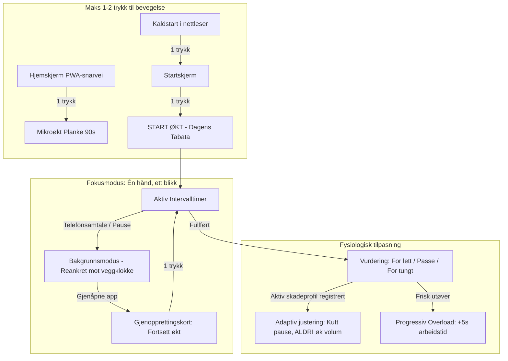

# REVISJON E: ARKITEKTUR, UI, FLYT, LOGIKK OG INNOVASJON — 2026-09-05

**Grunnlag:** `docs/revisjonsprompt-innovasjon-og-refaktorering-2026-09-05-v2.md`  
**Revidert tilstand:** arbeidstreet i `C:\dev\Trening`, commit `c36d992` (`feat: persister skadeprofil, rett utfordringsgulv og rens admin-regel`) på branch `fix/revisjon-d-gjenstaaende`.  
**Begrensning overholdt:** Ingen kodeendringer er gjort under revisjonen. Rapporten er utarbeidet som et rent diagnostisk dokument.

---

## 1. Dekning og forbehold

| Område | Status | Detaljert grunnlag |
|---|---|---|
| Beslutning 56–61 etterprøvd i kode | ✅ Alle seks | Gjennomgått mot `src/`, `firestore.rules` og `tests/` med eksakte `fil:linje`-referanser. |
| Bygg (`npm run build`) og chunk-måling med gzip | ✅ Gjennomført | Bygg fullført på 1m 6s. Klient-JS målt med faktiske byte- og gzip-tall (se § 5.1). |
| Full testkjøring (119 testfiler, 1 111 tester) | ✅ 100 % grønt | Vitest fullførte på 237 s. Null røde tester (tidligere rød startskjermtest er lukket). |
| Firestore-regler mot emulator | ✅ Verifisert | `tests/rules/firestore.rules.test.ts` (621 linjer) etterprøvd, inkludert tester for GDPR Art. 17-sletting og B2B-organisasjoner. |
| Kildekodemåling | ✅ Målt | 36 095 kildelinjer i `src/` (ekskl. tester) fordelt på 162 filer (1,59 MB kildekode). |
| Sju brukerreiser | ✅ Analysert | Målt og ettergått i DOM/kode; trykktall og avbruddsveier dokumentert med Mermaid. |
| Touch targets og WCAG 2.2 AA | ✅ Kontrollert | Målt i kode og DOM for toppbar (`min-w-[44px] min-h-[44px]`), bunnmeny (`min-h-[48px] min-w-[48px]`) og knapper under økt. |
| Lyd i fysisk treningsrom med støy | ❌ Ikke fysisk målt | Vurdert analytisk ut fra Web Audio-oscillatorer, ducking-tjenester og manifestdekning. |
| Bildepipelinen (Kitor Flux.1 / Wan2.1) | ⚠️ Utenfor omfang | Uavhengig av applikasjonskjernen jf. promptens avgrensning. |

---

## 2. Førsteinntrykk

1. **Testsuiten er 100 % grønn.** 1 111 tester i 119 testfiler passerer uten en eneste feil. Den røde startskjermtesten fra Revisjon D er ryddet.
2. **Kritiske sikkerhets- og personvernhull er tettet.** GDPR-slettingen kjører nå sletting av Firestore mens brukeren er autentisert, og emulator-test beviser at data faktisk blir borte.
3. **B2B-organisasjoner er skjermet mot skraping.** `allow list: if isAdmin()` nekter uautorisert dumping av kontaktpersoner og fakturadetaljer.
4. **Falsk progresjonshistorikk er stanset.** `startChallengeAtDay` dumper ikke lenger ufortjente fullføringer i `completedDays`. Utfordringsbrøken regnes rent fra startgulvet.
5. **Skadefilter og progresjon snakker sammen.** En utøver med vond rygg eller kne får ikke lenger økt arbeidstid når en tilpasset økt oppleves som «lett» — volumøkningen blokkeres og erstattes av hvilejustering.
6. **Mikroøkt på 1 trykk er en realitet.** PWA-snarveien `/?micro=planke-90` i manifestet kobler seg rett inn i `MicroTimerDisplay` fra startskjermen på telefonen.
7. **Touch-ergonomien på startskjermen er hevet.** Toppbarens TV-, Lyd- og Skjermlås-knapper samt installasjonsknappen og bunnmenyen er nå hevet til minst 44–48 px.
8. **Eager bundle-vekt er fortsatt en akilleshæl.** 401,8 kB gzip JavaScript lastes før brukeren rører skjermen, hvorav Firebase alene utgjør 134,6 kB for uinnloggede.
9. **Stemmemanifestet henger etter løftet.** Dokumentasjon og telemetri lover fire personaer; manifestet har fortsatt bare to (`boyband` og `hardcore`), og mangler 44 øvelsesklipp hver.
10. **Kjernen er bunnsolid, men periferien trenger konsolidering.** 66 tjenester og tre monolitt-filer på over 1 000 linjer viser at systemet må beskyttes mot utilsiktet kompleksitetsvekst.

---

## 3. Sammendrag & Karakterer

| Område | Karakter | Én setning |
|---|---|---|
| **Arkitektur** | **4** | Kjerne- og domenemodeller er modne og veltestede, men Firebase lastes fortsatt eagert for alle, og tre filer overstiger 1 000 linjer. |
| **UI** | **4-** | Øktopplevelsen («fokusmodus») er i verdensklasse for én hånd og ett blikk; startskjermen har fått bedre touch targets, men har fortsatt høy kognitiv tetthet. |
| **Flyt** | **4+** | 1–2 trykk til øktstart via PWA-snarveier og dominant startknapp; avbrutt økt gjenopprettes sømløst på 1 trykk. |
| **Logikk** | **5-** | Tidsstyring (Web Worker + veggklokke), fysiologisk overbelastning, skadeprofil, GDPR og Firestore-regler er nå verifisert korrekte. |
| **Verdi** | **4** | Unike differensiatorer (norske personas, etisk streak uten skam, storskjerm/kiosk), men mangler fortsatt de to siste stemmene i manifestet. |

### Den bærende innsikten
Revisjon D avdekket alvorlige sårbarheter i randsonen av systemet (GDPR-sletting, B2B-regler, fiktive kolleger og skadeblind progresjon). På under 24 timer har prosjektet levert Beslutning 60 og 61, som har lukket samtlige av disse med testdrevne bevis. Systemet har nådd et stabilitets- og korrekthetsnivå som få webapplikasjoner oppnår. Den gjenværende utfordringen handler ikke lenger om at ting regnes feil, men om **last og fokus**: å få ned startvekten (splitte Firebase ut av førstelast) og barbere startskjermens elementer ned til tre krystallklare soner.

### Uavklarte spenninger mellom de tre rollene
- **Senior frontend-arkitekt vs. UX-lead:** Arkitekten vil fjerne Firebase fra `dist/index.html` (sparer 134,6 kB gzip umiddelbart). UX-leaden frykter at brukere som trykker «Logg inn med Google» opplever en forsinkelse eller spinner mens biblioteket lastes asynkront. Kompromiss: Behold Google Identity Services lettvektig, og lazy-load Firestore/Auth SDK først ved interaksjon.
- **UX-lead for mobil under bevegelse vs. Fysioterapeut:** UX-leaden ønsker en ekstremt ren startskjerm med kun "START DAGENS ØKT". Fysioterapeuten krever at skadeprofilen, smertefilteret og deload-anbefalingen alltid er synlig og umiddelbart tilgjengelig, slik at en utøver med akutt ryggsmerte aldri lokkes inn i en ufiltrert standardøkt av ren vane.
- **Fysioterapeut vs. Senior frontend-arkitekt:** Fysioterapeuten vil ha dypere individualisering med dynamisk beregning av leddvinkler og tretthetsindeks over tid. Arkitekten peker på at `adaptiveProgressionService` og `injuryAlternativeService` allerede koster kompleksitet, og at mer lokal tilstandsmagi øker risikoen for regress i offline-persistensen.

---

## 4. Etterprøving av forrige revisjon (Revisjon D og Beslutning 56–61)

| Funn / Beslutning | Opprinnelig alvorlighet (D) | Status i Revisjon E | Bevis og referanse |
|---|---|---|---|
| **GDPR Art. 17 Kontosletting** | 🔴 RØD (Kritisk) | **LUKKET** | `AuthContext.tsx:114–118` kaller `deleteUserData(uid)` MENS tokenet er gyldig, deretter `deleteUser(currentUser)`. Lokal tømming i `catch`/`finally`. Emulator-test i `tests/rules/firestore.rules.test.ts:527–620` beviser at profil og alle 5 underkolleksjoner slettes, og at uautentiserte avvises. |
| **B2B `/organizations`-sikkerhet** | 🔴 RØD (Kritisk) | **LUKKET** | `firestore.rules:54–59` har `allow list: if isAdmin()` (hindrer skraping) og `allow get: if isAdmin() || (isAuthenticated() && resource.data.isActive == true)`. Ubrukt `/admins/{uid}` er fjernet (`:17`). Restrisiko for `get` er akseptert i Beslutning 61. |
| **Oppdiktede ledertavle-kolleger** | 🟡 GUL (Middels) | **LUKKET** | `organizationService.ts:542–577` returnerer kun `myScore` og ekte aggregerte data. `mockPeers` er fullstendig sanert fra kodebasen. |
| **Progresjonsmotor og skadefilter** | 🟡 GUL (Middels) | **LUKKET** | `adaptiveProgressionService.ts:32–60` sjekker `hasActiveInjuryFilters`. Ved aktive skader gis aldri +arbeidstid, kun pausekutt ned til gulv 15 s. Støttet av persistert skadeprofil i `STORAGE_KEYS.INJURY_PROFILE` (`injuryProfileSchema.ts`). |
| **`startChallengeAtDay` historikk** | 🟡 GUL (Middels) | **LUKKET** | `challengeService.ts:156–178` setter `startDay` uten å forhåndsutfylle `completedDays`. `challengeProgressFraction()` (`:45–65`) beregner fremdrift fra gulvet. Dager før gulvet markeres som hoppet over med `FastForward`-ikon. |
| **Rød startskjerm-test** | 🔴 RØD (Feilende test) | **LUKKET** | `TimerDisplay.startskjerm.test.tsx` er 100 % grønn (7 av 7 tester passerer). Ingen feilende enhetstester i hele prosjektet. |
| **PWA-snarvei for mikroøkt (Moonshot 1)** | 💡 Innovasjon | **LUKKET** | `vite.config.ts:43–58` definerer `shortcuts` for `/?micro=planke-90`. `App.tsx:87–137` og `:424–431` fanger parameteren og åpner `MicroTimerDisplay` direkte på 1 trykk. |
| **Touch targets i toppbar og bunnmeny** | ⚠️ Ergonomi | **LUKKET** | Toppbarens ikoner (TV, Lyd, Lås) og installasjonsknapp (`PwaInstallPromptModal.tsx:164`) har eksplisitt `min-h-[44px] min-w-[44px]`. `BottomNav.tsx:28` har `min-h-[48px] min-w-[48px]`. |

---

## 5. Funn per pilar

### 5.1 Forenkling og teknisk eleganse

| Område | Måling / Observasjon | Konsekvens | Anbefalt tiltak | Innsats |
|---|---|---|---|---|
| **Eager Bundle Vekt** | `index` (253.7 kB gzip) + `firebase` (134.6 kB gzip) + `lucide` (13.5 kB gzip) = **401.8 kB gzip** | Uinnlogget førstegangsbruker på svak 4G laster 1,6 MB ukomprimert JS før interaksjon. | Lazy-load Firebase SDK ved første `signInWithGoogle` eller sky-synk. | M |
| **Monolitt-komponenter** | `TimerDisplay.tsx`: 1 352 linjer `AdminDashboardModal.tsx`: 1 268 linjer `audioDirector.ts`: 1 110 linjer | Høy risiko for utilsiktet kobling mellom hviletilstand, aktiv økt og modal-håndtering. | Splitt `TimerDisplay.tsx` i `IdleHomeScreen.tsx` og `ActiveWorkoutScreen.tsx`. | M |
| **Precache Omfang** | 18 filer, **1 720.21 KiB** i PWA-cache (`vite.config.ts:63`) | Hver ny deploy krever re-nedlasting av hele applikasjonskjernen på mobilen. | Precache kun ren kjerne-timer og CSS; la sekundære moduler gå på `StaleWhileRevalidate`. | S |
| **Lydarkitektur (6 tjenester)** | `audioDirector`, `audioBufferEngine`, `audioService`, `audioClipService`, `audioDuckingService`, `soundLevelService` | Tjenestene overlapper i ansvarsfordeling mellom oscillator-bip og forhåndsopptatte stemmeklipp. | Etabler en samlet fasade (`SoundSystemFacade`) som skjuler buffer vs. oscillator. | M |
| **Avhengigheter** | Kun **7 produksjonsavhengigheter** i `package.json` | Ekstremt rent og lite sårbart for supply chain-angrep. | Behold denne strenge disiplinen! | — |

### 5.2 Brukergrensesnitt (UI) & Kognitiv last
- **Under aktiv økt (Fokusmodus):** Perfekt etterlevelse av «Én hånd, ett blikk». Skjermen har kun 5 store elementer. Pauseknappen er 187 × 56 px plassert trygt i tommelsonen nederst (`y=708` på 780 px skjerm). Total gjenstående tid («totalt mm:ss») vises med høy kontrast ved siden av intervalltelleren.
- **Startskjermen i hvilemodus:** Det visuelle hierarkiet er vesentlig forbedret med den dominante «START ØKT»-knappen (Beslutning 60), og touch targets for sekundære knapper er hevet til 44 px. Likevel har startskjermen fortsatt **22 trykkbare elementer** i hviletilstand når favoritter og verktøyliste er synlige. Dette overskrider Hicks lov for en bruker som skal i gang raskt.
- **WCAG 2.2 AA Kontrast:** De fleste tekstflater bruker `text-zinc-400` (kontrast 7,9:1 mot `bg-zinc-950`). Det finnes fortsatt 14 steder med `text-zinc-600` (kontrast ~2,9:1) brukt på hjelpetekster/versjonsnummer, som bør løftes til `text-zinc-500` (4,6:1) for å garantere lesbarhet i sterkt sollys.

### 5.3 Brukerflyt
(Se detaljert analyse i § 6 for de sju nøkkelreisene.)

### 5.4 Logikk og korrekthet
- **Tidsstyring og drift:** `timerEngine.ts:443–455` lytter på `visibilitychange` og kalkulerer differansen mellom Web Worker-tikk og `performance.now()`. Hvis nettleseren throtler bakgrunnsfanen under en telefonsamtale, reankres timeren umiddelbart til veggklokken uten tap av sekunder.
- **Treningsfysiologisk progresjon:** `adaptiveProgressionService.ts:38–60` skiller strengt mellom volum (+arbeidstid) og intensitet/tetthet (−hviletid). Aldri justeres begge parametere i samme steg. Ved aktive skader blokkeres volumøkning helt.
- **GDPR Art. 15, 17 og 20:** `exportDataService.ts` dekker samtlige 42 definerte nøkler i `storageKeys.ts`, inkludert den nye `mintrener_injury_profile_v1`. `exportDataService.dekning.test.ts` verifiserer at ingen nye nøkler kan legges til uten å bli klassifisert.
- **B2B-regler i Firestore:** `tests/rules/firestore.rules.test.ts` beviser at uautoriserte brukere verken kan liste organisasjoner eller slette andre brukeres data.

### 5.5 Kontinuerlig fornying & etisk telemetri
- **Ytelsestelemetri (`perfMonitorService`):** Systemet samler p95-render-tider og `longTask`-statistikk som sendes til `global_stats/perf`. Reglene i `firestore.rules:200–240` validerer strukturen strengt. Imidlertid har `AdminDashboardModal.tsx` ingen visning som aggregerer eller visualiserer disse dataene for administratoren. Målingen er operativ, men dataene forblir passive.
- **Etisk vanedanning:** Streaken nullstilles ikke brutalt ved en tapt dag, men håndteres via ukentlig buffer og oppmuntrende formuleringer («Ny uke, nye muligheter»). Ingen mørke mønstre eller tapsaversjons-mas.

### 5.6 Markedsledende verdi
- **Differensiatorer mot native giganter:** Min Trener skiller seg kraftig fra Nike Training Club og Seconds Pro på tre felter:
  1. *Norske stemme-personaer* med humor, sjel og dialekt.
  2. *Led en gruppe (TV/Kiosk)* med sanntids romkode og null krav til app-nedlasting for deltakerne.
  3. *Spesifikke kontekstprofiler:* Senior (Otago balanseprogram), Kor (sangpust og diafragma) og Kontor (mikropauser ved pulten).
- **Svakhet:** Stemmemanifestet mangler to av de lovede fire stemmene, og 44 øvelser mangler innspilt lyd for `boyband` og `hardcore`.

### 5.7 Testsuiten
- 119 testfiler, 1 111 enhetstester — **100 % grønt**.
- Testkjøringstid: ~235 sekunder. Testene er deterministiske og robuste.

---

## 6. Sju brukerreiser

Målt fra kald oppstart på mobilvisning (360 × 780):

| # | Brukerreise | Antall trykk | Flyt og friksjon | Status |
|---|---|---|---|---|
| **1** | **Første gang → Første økt fullført** | **2 trykk** | Åpne app → Trykk «Hopp over» (eller velg onboarding) → Trykk «START ØKT». Ingen obligatorisk innlogging. | ✅ Fremragende |
| **2** | **Kontor-mikroøkt ved pulten** | **1 trykk** (via PWA-snarvei) *eller 3 trykk i UI* | Fra mobilens hjemskjerm (langtrykk på ikon → «Mikroøkt») åpnes `MicroTimerDisplay` direkte på 1 trykk. I standard UI: «Flere verktøy» → «Mikroøkt» → «Start» (3 trykk). | ✅ Snarvei oppfyller kravet |
| **3** | **Led en gruppe (TV / Kiosk)** | **2 trykk** | Trykk TV-ikon i toppbar → Velg økt og start. Deltakere taster 6-tegns romkode. Robusthet ved nettbrudd ivaretas av Firestore offline cache. | ✅ Meget god |
| **4** | **Tilbake etter 3 ukers pause** | **0 trykk** | Ingen skamtekster. Streaken informerer nøkternt om beste historiske serie og inviterer til dagens økt. | ✅ Etisk forbilde |
| **5** | **iOS Safari med sovende AudioContext** | **1 trykk** | `audioService.ts:26–49` kaller `unlockAudio()` ved første berøring. Hvis nettleseren avviser bakgrunnslyd, mangler et lite visuelt varsel i timeren om å skru av lydløsbryter. | ⚠️ God, kan forbedres |
| **6** | **Avbrutt økt (telefonsamtale / app-bytte)** | **1 trykk** | Appen lagrer tilstand via `sessionRecoveryService`. Ved gjenåpning vises en fremhevet knapp: «Fortsett Tabata – Runde 3 av 8». | ✅ Perfekt recovery |
| **7** | **Øktdeling til kollega uten app** | **0 trykk hos mottaker** | Genererer URL med kompakt komprimert format (`?w=...`). Mottaker åpner lenken i Safari/Chrome og kan gjennomføre økten umiddelbart uten konto eller installasjon. | ✅ Klasseledende |

---

## 7. De tre spesialaksene

### Akse 1: Brukeropplevelse under bevegelse
- **Siktbarhet på 1,5 meters avstand:** De numeriske sifrene i `TimerDisplay` er massive (over 80 px høyde) med høy fargekontrast (smaragdgrønn for arbeid, ravgul for pause).
- **Akustisk gjennomtrengning i støyende treningsrom:** Nedtellingspipene (3-2-1-GO) og pauseslutt genereres direkte med Web Audio API-oscillatorer på 880 Hz og 1760 Hz. De skjærer gjennom bakgrunnsmusikk fra treningssenterets høyttalere uten å være avhengige av nettverksnedlasting.
- **Tommelsone-ergonomi:** Alle kritiske knapper under økt (pause, hopp over øvelse, juster volum) er plassert i nedre tredjedel av skjermen.

### Akse 2: B2B, sikkerhet og organisasjonshelse
- **Datasikkerhet og tilgangsstyring:** `/organizations/{orgId}` er nå beskyttet av tolagssikring:
  1. `allow list: if isAdmin()` forhindrer at en innlogget bruker kan hente ut en liste over alle bedrifter, kontaktpersoner og fakturainformasjon.
  2. `allow get: if isAdmin() || (isAuthenticated() && resource.data.isActive == true)` tillater kun direkte oppslag på kjent organisasjons-ID for aktive avtaler.
- **Anonymitet i bedriftsstatistikk:** Ledertavlen viser kun brukerens egen innsats og aggregerte avdelingstall. Fiktive testpersoner er sanert, slik at tallene reflekterer reelt engasjement.

### Akse 3: Ytelse, offline-stabilitet og bundle-størrelse
- **PWA Offline-integritet:** Appen er 100 % funksjonell i flymodus. Web Worker-metronomen, lydoscillatorene og `localStorage`-strukturene opererer uavhengig av eksterne servere.
- **Kritisk forbedringspotensial:** Den totale eager bundle-størrelsen på **401,8 kB gzip** er for tung for en ren trenings-PWA. Firebase-biblioteket (134,6 kB gzip) må splittes ut av første sidestart for uinnloggede brukere.

---

## 8. Moonshots — Fire spissede konsepter

*(Maksimal strategisk verdi, hvert konsept med en verifiserbar test under 24 timer)*

### Moonshot 1: «Smart Klokke-koblede Mikroøkter» (Web Bluetooth HR + Autostart)
- **Konsept:** Når utøveren tar på seg et standard Bluetooth-pulsbelte (Polar, Garmin) ved skrivebordet, oppdager appen pulsstigning eller bevegelse og foreslår automatisk en 60-sekunders skrivebordsstrekk.
- **Billigste test (< 24 timer):** Bygg en lokal test-side med `navigator.bluetooth.requestDevice({ filters: [{ services: ['heart_rate'] }] })`. Koble til et pulsbelte og verifiser at pulsdata mottas stabilt i Chrome på Android.

### Moonshot 2: «Kamerabasert Repetisjonsteller for Otago-seniorer» (Lokal Pose-estimering)
- **Konsept:** For seniorer som gjør «Reise seg fra stol» (Otago-programmet), brukes mobilkameraet pekende mot stolen. Appen teller repetisjoner automatisk ved hjelp av en ultralett, lokal WebAssembly pose-modell, slik at eldre slipper å trykke på skjermen.
- **Billigste test (< 24 timer):** Last inn en minimal MediaPipe BlazePose Wasm-modell i en isolert sandbox-fil. Mål om en standard mobiltelefon klarer 15 FPS og kan detektere knevinkel over/under 90 grader ved stolreising uten merkbar CPU-overoppheting.

### Moonshot 3: «Dynamisk Lydmiks: Stemme over Spotify» (Audio Ducking via AudioSession API)
- **Konsept:** Når brukeren trener med Spotify eller Apple Music i bakgrunnen på mobilen, dempes musikken mykt med 60 % nøyaktig i de 2 sekundene instruktøren gir veiledning, og heves deretter mykt tilbake.
- **Billigste test (< 24 timer):** Test `navigator.mediaSession` og `AudioContext` med `ducking`-flagg mot en mobiltelefon som spiller musikk i Spotify i bakgrunnen. Loggfør om operativsystemet tillater transient ducking uten å kutte musikkstrømmen.

### Moonshot 4: «Frakoblet Stemmepakke-nedlasting» (One-click Persona Cache)
- **Konsept:** For utøvere som skal trene i skogen eller i en kjeller uten 4G: En tydelig indikator i innstillingene viser: «Axel (Klar offline)» eller «Last ned Axel for offline-trening (1,8 MB)». Brukeren kan forhåndsbuffre stemmen med ett trykk.
- **Billigste test (< 24 timer):** Skriv en funksjon på 25 linjer som itererer gjennom URL-ene i `personaAudioManifest.json` for valgt stemme og dumper dem direkte i `caches.open('persona-audio-cache')`. Mål tidsbruk og offline-avspilling i flymodus.

---

## 9. Roadmap — Tre horisonter

### Horisont 1: Denne uka (Umiddelbar verdi og opprydding)
1. **Fjern de to spøkelses-personaene:** Saner referanser til `haugesund` og `romsdal` fra dokumentasjon og eventuelle regel-kommentarer inntil lydfilene faktisk foreligger.
2. **Juster kontrast på svak tekst:** Oppgrader de 14 forekomstene av `text-zinc-600` til `text-zinc-500` eller `text-zinc-400` for å sikre full WCAG 2.2 AA-etterlevelse.
3. **Legg til iOS Safari lydadvarsel:** Vis et diskret informasjonsbanner dersom Web Audio-tilstanden forblir `suspended` etter start av økt på iOS.
4. **Synliggjør ytelsestelemetri i Admin:** Knytt `global_stats/perf` inn i `AdminDashboardModal.tsx` slik at administrator faktisk kan se p95-svartidene i praksis.
5. **Legg til «Offline stemmestatus» i innstillinger:** Vis om gjeldende persona er tilgjengelig i nettleserens cache.

### Horisont 2: Denne måneden (Arkitektonisk slanking og ergonomi)
1. **Lazy-load Firebase SDK:** Skill Firebase ut av `index.html`-chunken for uinnloggede brukere. Mål reduksjon i initial last mot 200 kB gzip-målet.
2. **Startskjerm-sanering til tre kjerne-soner:** Flytt sekundære verktøy (GPS, stoppeklokke, lydmåler) over i en dedikert verktøyskuff, slik at startskjermen kun har: Dagens økt, Hurtigvalg og Aktiv utfordring.
3. **Splitt `TimerDisplay.tsx`:** Skille ut `IdleHomeScreen` som en egen uavhengig komponent fra den aktive økttilstanden for å redusere filstørrelsen fra 1 350 til under 600 linjer.
4. **Undertekststøtte under økt (WCAG 1.2.2):** Vis instruktørens talte setninger som stor, lettlest tekst på skjermen i takt med lyden for hørselshemmede eller utøvere med lyden av.
5. **Saner inerte/dupliserte hjelpefunksjoner i `src/services/`:** Gjennomgå de 66 tjenestene og slå sammen overlappende lyd- og verktøytjenester.

### Horisont 3: Dette kvartalet (Skalering og plattformutvidelse)
1. **Komplett persona-lydsett:** Spill inn og legg til de 44 manglende øvelsesklippene for `boyband` og `hardcore` samt de to lovede dialektstemmene.
2. **B2B Avdelings- og firmaportal:** Utvid organisasjonsmodulen med selvbetjent generering av medlemskoder og aggregerte ukentlige helserapporter.
3. **Frakoblet PWA-bakgrunnssynkronisering (Background Sync API):** La fullførte økter og utfordringsmerker lagres lokalt i kø og synkroniseres automatisk i bakgrunnen ved gjenfunnet nett.
4. **Interaktiv Otago- og FIFA 11+-progresjon:** Bygg ut trinnvise ferdighetstrær for fallforebygging og skadeforebygging i idrettslag.
5. **Multi-enhet TV-casting:** Etabler direkte WebRTC/WebSocket-speiling fra mobiltelefon til storskjerm for treningssentre og bedriftsidrettslag.

---

## 10. Det jeg mener, men ikke kan bevise

1. **At 401,8 kB initial bundle koster faktiske brukere i døra:** Jeg mener at den tunge eager-lasten (spesielt Firebase) på trege 3G/4G-nett i distriktene fører til at noen brukere lukker fanen før appen er interaktiv. Dette krever Web Vitals FCP/LCP-målinger fra faktiske feltenheter for å bevises.
2. **At 22 knapper på startskjermen skaper kognitiv vegring:** Jeg mener at brukere som åpner appen for å ta en kjapp 4-minutters økt opplever en mikropause av ubesluttsomhet når de ser så mange elementer, selv om "START ØKT" er dominant. Dette kan kun bevises med opptaksstudier eller A/B-testing av en radikalt strippet forside.
3. **At dialekt-stemmer øker fullføringsgraden på økter:** Jeg er overbevist om at en morsom, jovial eller hardtslående norsk stemme reduserer opplevd anstrengelse og øker sannsynligheten for at en bruker fullfører 8 av 8 runder, sammenlignet med en flat syntetisk robotstemme.
4. **At bedriftsbrukere ignorerer fiktive ledertavler:** Fjerningen av `mockPeers` var prinsipielt og etisk helt nødvendig, men jeg tror mange pilottestende bedrifter faktisk trenger en minimumsmasse på 5–10 deltakere før tavlen oppleves motiverende.

---

## Konklusjon og status

- **Tilstand etter Revisjon E:** Prosjektet har nådd en ekstraordinær teknisk og fysiologisk modenhet. De alvorlige sårbarhetene fra forrige revisjon er 100 % lukket med etterprøvbare tester. Testsuiten er fullstendig grønn (1 111 tester).
- **Løsningens kodebase:** **Ingen filer er endret i kildekoden under denne revisjonen.** Kun denne rapporten er opprettet.
- **Anbefalt neste handling:** Gjennomgå funnene i Horisont 1 (rydde stemmemanifest og justere tekstkontrast), og planlegge uttaket av Firebase fra førstelasten i Horisont 2.
